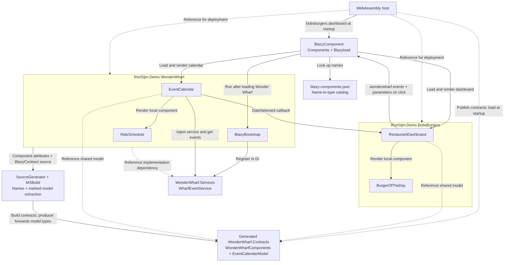

# Extensive: Bob's Burgers, Wonder Wharf and lazy-loaded components

[Open the extensive demo](https://ronsijm.github.io/RonSijm.Blazyload.Components/Extensive/). It keeps the sales-site styling, but component composition is the product. Consumer code, loading steps and dependency boundaries are visible on the page; the loaded calendar shows its producer code and generated contract.

The live site uses the [shared orchestrator](../README.md#what-does-the-orchestrator-do). It loads Bob's Burgers by name, then keeps the same Blazor runtime when you switch to Simple. The storefront's components don't need to know which host rendered them.

This is the fuller example, including generated component names, exported models, feature services and static assets. For composition with as few changes and dependencies as possible, start with [Simple](../Simple/README.md). Neither the storefront nor the source-generator package is required to render a component by name.

For a feature that also brings its own shared state, actions, reducers, effects and middleware, see [Fluxor](../Fluxor/README.md). It is a separate third example, not an extra dependency of this demo's standalone host or feature libraries.

## What's being composed?

Bob's Burgers is the **consumer**: the feature displaying another feature's UI. Wonder Wharf is the **producer**: the feature implementing that UI. The **host** is the runnable Blazor WebAssembly app, which starts .NET in the browser and publishes the files for both features.

Each feature is a **Razor Class Library**, a reusable project containing `.razor` components and optional static assets. Building it produces an **assembly**, a compiled .NET library containing its types. Lazy loading means waiting to download that library until it is requested, not downloading one Razor source file at a time.

The **contracts** assembly is a smaller shared library containing C# models and component-name constants, but no calendar UI. Bob's Burgers needs those shared types to pass data without referencing the implementation that draws the calendar.

Bob wants upcoming Wonder Wharf events on the restaurant dashboard. The Bob's Burgers domain shouldn't have a compile-time dependency on Wonder Wharf's UI implementation.

It asks for this:

```razor
<BlazyComponent Name="@WonderWharfComponents.Events" />
```

`WonderWharfComponents.Events` is a generated constant for `"wonderwharf.events"`. Bob's Burgers references the generated contracts, not Wonder Wharf's component types. The WebAssembly host includes Wonder Wharf in the application. Blazyload downloads the implementation when it's needed, and Components finds and renders the calendar.

I kept the restaurant and the wharf in separate libraries so you can inspect the project references and check that Bob's Burgers doesn't depend on Wonder Wharf's implementation. Putting everything in one project would hide that part of the example.

The code in both Bob's Burgers and Wonder Wharf is deliberately ugly and kept as small as possible. Anything that isn't needed for the demo is left out, so lazy loading and component interaction don't get buried under unrelated application code. The page keeps the restaurant's branding, but explains components instead of selling burgers. Event names and dates are hardcoded service payloads. There is no ordering or payment system.

## Run it

To run Extensive by itself, use its standalone host and a .NET 10 SDK. From this `Examples\Extensive` directory:

```powershell
dotnet run --project .\RonSijm.Demo.Blazyload.Components.Extensive.Host
```

Open the address printed by the development server:

1. You'll see **Compose first. Download later.**, the consumer's Razor request and its current request status.
2. Click **Load Wonder Wharf component**. The **Request it. Watch it arrive.** section explains the name lookup, feature load and Blazor rendering.
3. The calendar appears with the title and model from Bob's Burgers, data from its own service, and a directly rendered `RideSchedule`.
4. Click **Send DateSelected callback** to return `2026-10-10`. Bob's Burgers displays it under **DateSelected callback result**.
5. Click **Update Title parameter** to change the existing calendar's heading.

The code isn't hidden behind expandable sections. **Keep the contract. Skip the UI dependency.** explains the project references. **Your data goes in. A normal callback comes back.** shows the parameter dictionary. The calendar shows its implementation-side code, exported model and JavaScript result. **Plain Razor. No extra ceremony.** shows how `BurgerOfTheDay` renders normally inside its own domain.

Look at the calendar as well as the buttons:

- The event list comes from `WharfEventService`, registered by Wonder Wharf's bootstrap (its service-registration code).
- The JavaScript message comes from Wonder Wharf's module.
- The red border comes from scoped CSS.
- The image is a Razor Class Library static asset.

The example uses project references to Components. In your own application, use its NuGet package instead.

### What does Extensive add over Simple?

The page's **Extra tooling** link opens a visible comparison and contracts-export walkthrough. You can read it before loading the calendar.

| Concern | Simple | Extensive |
|---|---|---|
| Component names | String literals such as `"pizza.calendar"` | Generated constants such as `WonderWharfComponents.Events` |
| Shared model | Handwritten `PizzaCalendarModel` in a separate contracts project | `[BlazyContract]` model kept in producer source and exported into a generated contracts assembly |
| Consumer reference | Ordinary reference to the handwritten contracts project | `BlazyComponentContractReference` to the producer's generated contracts |
| Extra tooling | No source-generator package | `RonSijm.Blazyload.Components.SourceGenerator`, including its MSBuild exporter |

The page shows the marked producer source next to the resulting shared API, then explains the build steps. Both features use the model type from the generated contracts assembly instead of compiling separate copies. Bob's Burgers receives the model and name constants without referencing the UI implementation or its services. [Where does the contracts assembly come from?](#where-does-the-contracts-assembly-come-from) explains how the build keeps that one shared type.

The generator and exporter run at build time, not in the browser. The resulting contracts DLL is still a library the running app needs. When a producer is configured to create NuGet packages, the tooling also creates a companion `.Contracts` package. The demo projects disable package creation.

Both demos already use Blazyload for assembly loading and Components for name-based rendering. Both also generate the host's component catalog and demonstrate parameters, callbacks, dependency injection (DI) and static assets. Those aren't reasons to install the source generator. Its benefit is avoiding handwritten names and a separately maintained contracts project; parameter dictionary checks still happen at runtime.

### Watch on-demand downloads in DevTools

1. Open the browser's developer tools (**F12**, or use its menu).
2. Select **Network**, enable **Disable cache** and reload.
3. Filter for `WonderWharf`.
4. Click **Load Wonder Wharf component**.

`RonSijm.Demo.WonderWharf` and `RonSijm.Demo.WonderWharf.Services` should appear when you click the button, not while only the restaurant dashboard is visible.

These are the feature's DLL assemblies, but .NET 10 serves them as **`.wasm` files**. Published names can also contain a **fingerprint**, a content-based identifier used for browser caching. Filter by part of the assembly name rather than an exact filename. Filtering only for `.dll` would make a fairly convincing demonstration of nothing happening.

`WonderWharf.Contracts` is different: it contains generated name constants and the shared parameter model. It loads when you choose Extensive in the orchestrator, or at startup in the standalone host. Seeing that request before clicking the events button is expected.

Changing the title or selecting a date doesn't download the assemblies again. Reload with **Disable cache** enabled if you want to watch the first load another time. Leaving the demo through the site's navigation doesn't unload code already in memory.

## Which library does what?

### RonSijm.Blazyload

Use Blazyload when you want to defer loading a page or feature assembly.

**Bootstrap** means the service-registration code the feature runs after it has loaded. Dependency injection (DI) then supplies those registered services to components through `@inject` or constructor injection.

It handles:

- Assembly downloads and fingerprinted filenames.
- Configured dependency loading.
- Feature bootstrap/service registration.
- Giving Blazor's router the loaded assemblies through `AdditionalAssemblies`, so it can discover their pages.

You can use it without Components. A routed page or an explicit `LoadAssemblyAsync` call doesn't need a logical component name or manifest.

### RonSijm.Blazyload.Components

Use Components when one feature needs to render another feature's component without referencing its implementation type.

The **catalog**, also called the **manifest**, is `blazy-components.json`: a lookup file containing friendly names, assembly names and full component type names. The runtime **registry** reads those entries and asks Blazyload for the required assembly. You don't write either service yourself for the normal setup.

It adds:

- The `[BlazyComponent("wonderwharf.events")]` attribute.
- A generated `blazy-components.json` catalog.
- Resolution of a name to a component type.
- The `<BlazyComponent>` wrapper, with normal Blazor parameters and callbacks.

Components still uses Blazyload for assembly loading and DI. It doesn't introduce another loader.

### RonSijm.Blazyload.Components.SourceGenerator

Use the optional tooling package when you want exported names and models without maintaining a contracts project.

A **source generator** runs inside the C# compiler and adds C# source during the build. This package's generator creates component-name constants and supplies the `[BlazyContract]` attribute. Its **MSBuild exporter** is another build step: it creates the contracts project and compiles the marked shared models into it.

In this demo the result is `WonderWharfComponents` plus the shared `EventCalendarModel` in a generated contracts assembly. The model's source still belongs to Wonder Wharf. There is no handwritten contracts project and no generator running in the browser.

## Does the host still reference Wonder Wharf?

Yes. The host needs Wonder Wharf's assembly and assets in the application it publishes.

Bob's Burgers is the project that doesn't need the implementation reference:

```text
Host        -> BobsBurgers
Host        -> WonderWharf
Host        -> WonderWharf.Contracts
BobsBurgers -> WonderWharf.Contracts
WonderWharf -> WonderWharf.Contracts
WonderWharf -> WonderWharf.Services
```

The projects are:

| Project | What it owns |
|---|---|
| `RonSijm.Demo.Blazyload.Components.Extensive.Host` | Application startup and deployment references |
| `RonSijm.Demo.BobsBurgers` | `BurgerOfTheDay`, `RestaurantDashboard` and the callback handler |
| `RonSijm.Demo.WonderWharf` | `EventCalendar`, `RideSchedule` and the feature bootstrap |
| `RonSijm.Demo.WonderWharf.Contracts` (generated assembly) | `WonderWharfComponents` constants and the shared `EventCalendarModel` |
| `RonSijm.Demo.WonderWharf.Services` | `WharfEventService`, used only by Wonder Wharf |

Bob's Burgers references Components and WonderWharf.Contracts, not WonderWharf or WonderWharf.Services.

Bob's Burgers and the host use `BlazyComponentContractReference` to request the generated contracts from Wonder Wharf's source project. This package-specific build item means "build that producer's contracts and let this project reference them." A normal `ProjectReference` would instead give Bob's Burgers access to the implementation.

The host also has a normal producer reference because it must deploy the implementation. Its contracts-only item ensures the generated shared DLL is published too. The standalone host downloads contracts at startup; the orchestrator defers them until Bob's Burgers loads because its own code doesn't construct the models.

This repository connects the tooling from source. In your own application, install `RonSijm.Blazyload.Components.SourceGenerator` as described in the [contracts setup](../../README.md#generate-contracts-without-maintaining-another-project).

A host reference makes a feature available for deployment. Marking its assembly as lazy prevents the normal startup download. Those are separate decisions.

### Which components belong to which domain?

The two feature libraries contain:

```text
RonSijm.Demo.BobsBurgers
    Components
        BurgerOfTheDay.razor
        RestaurantDashboard.razor

RonSijm.Demo.WonderWharf
    Components
        EventCalendar.razor
        RideSchedule.razor
```

All four components have catalog names:

| Component | Name |
|---|---|
| `BurgerOfTheDay` | `bobsburgers.burger-of-the-day` |
| `RestaurantDashboard` | `bobsburgers.dashboard` |
| `EventCalendar` | `wonderwharf.events` |
| `RideSchedule` | `wonderwharf.rides` |

Within its own domain, the dashboard renders `<BurgerOfTheDay />` normally. It crosses the domain boundary with `<BlazyComponent Name="@WonderWharfComponents.Events" />`. Wonder Wharf's calendar renders `<RideSchedule />` normally because those two components already share an implementation assembly.

You could also request `<BlazyComponent Name="wonderwharf.rides" />` directly from another feature. Lazy loading works at assembly level, though: events and rides live in the same DLL, so loading either brings in that implementation assembly.

### How do they interact?

This diagram describes the **standalone Extensive host**. Its references determine what can be built and published; its lazy-load settings determine when assemblies reach the browser. The shared orchestrator uses the same features but waits until you choose Extensive before requesting Bob's Burgers and its contracts.

Dashed arrows are references between compiled libraries. Solid arrows show the contracts build and the runtime requests, rendering, service use and callbacks:



There is no project-reference arrow from Bob's Burgers to Wonder Wharf's implementation or services. The cross-domain request is a component name plus parameters; the return trip is the callback supplied by the restaurant.

## Set up Components

### Wire up the host

The following host setup describes the standalone example. Its `Client\Program.cs` adds these calls before `builder.Build()`:

```csharp
using RonSijm.Blazyload;
using RonSijm.Blazyload.Components;

builder.UseBlazyload();
builder.Services.AddBlazyloadComponents();
```

`UseBlazyload` configures assembly loading and DI support. `AddBlazyloadComponents` adds the services that read the catalog, look up a component name and remember the result.

The host project marks these assemblies as lazy:

```xml
<ItemGroup>
  <BlazorWebAssemblyLazyLoad Include="RonSijm.Demo.BobsBurgers.wasm" />
  <BlazorWebAssemblyLazyLoad Include="RonSijm.Demo.WonderWharf.wasm" />
  <BlazorWebAssemblyLazyLoad Include="RonSijm.Demo.WonderWharf.Services.wasm" />
</ItemGroup>
```

WonderWharf.Contracts stays available at startup because Bob's Burgers uses its model.

Package consumers get automatic catalog generation in a WebAssembly host. This source example also sets `BlazyComponentsGenerateManifest` to `true` explicitly. The build reads type and attribute information from the referenced compiled libraries; you don't maintain a second list of component names by hand.

### Name the producer

Wonder Wharf's `Components\EventCalendar.razor` declares:

```razor
@using RonSijm.Blazyload.Components
@attribute [BlazyComponent("wonderwharf.events")]
```

You can put the same attribute on a C# component or Razor code-behind.

This is a friendly name plus a marker for build-time discovery. It tells the build task to add a catalog entry mapping `wonderwharf.events` to Wonder Wharf's assembly and component type.

It also preserves the component when **trimming** removes apparently unused code during publication. Because a name-based lookup doesn't directly reference `EventCalendar` in C#, the trimmer needs that instruction to keep it.

It doesn't make the component renderable or act as a permission check. Blazor can render a component without it if you already have the type. Components can also resolve an unattributed component through [manual registration](../../README.md#what-if-i-dont-want-a-generated-catalog). It needs a catalog entry, not necessarily an attribute.

- Use a unique, stable name.
- Names are case-sensitive.
- Duplicate names fail catalog generation.
- The target must be public and instantiable: not abstract, and not a generic type with unspecified type arguments.

The name is the public identifier agreed with Bob's Burgers. The C# class name and namespace can change as long as the friendly name stays the same and the catalog is rebuilt.

### Render it from Bob's Burgers

Bob's Burgers imports Components and the generated contracts, then uses the name constant:

```razor
@using RonSijm.Blazyload.Components
@using RonSijm.Demo.WonderWharf.Contracts

<BlazyComponent Name="@WonderWharfComponents.Events" />
```

Put the import in `_Imports.razor` if several components use it.

### Parameters and callbacks

Wonder Wharf's calendar declares ordinary Blazor parameters: properties marked `[Parameter]`. A dictionary entry named `"Title"` sets the same property that markup such as `<EventCalendar Title="Team outing" />` would set if the consumer referenced the implementation.

| Parameter | Type | Used for |
|---|---|---|
| `Title` | `string` | Calendar heading |
| `Model` | `EventCalendarModel?` | The restaurant planning a visit |
| `DateSelected` | `EventCallback<DateOnly>` | Sending the selected date back to Bob's Burgers |

Pass them in a dictionary:

```razor
@using Microsoft.AspNetCore.Components
@using RonSijm.Blazyload.Components
@using RonSijm.Demo.WonderWharf.Contracts

<BlazyComponent Name="@WonderWharfComponents.Events" Parameters="@_parameters" />
<p>@_selectedDate</p>

@code {
    private Dictionary<string, object?> _parameters = [];
    private string? _selectedDate;

    protected override void OnInitialized()
    {
        _parameters = new Dictionary<string, object?>
        {
            ["Title"] = "Upcoming Wonder Wharf events",
            ["Model"] = new EventCalendarModel("Bob's Burgers"),
            ["DateSelected"] = EventCallback.Factory.Create<DateOnly>(this, HandleDateSelected)
        };
    }

    private void HandleDateSelected(DateOnly date)
    {
        _selectedDate = date.ToString("yyyy-MM-dd");
    }
}
```

`Parameters` accepts an `IReadOnlyDictionary<string, object?>` so different properties can receive different value types. Objects are passed directly, not serialized to JSON or sent to another server.

This snippet requests the calendar immediately. The actual dashboard waits for **Load Wonder Wharf component** before creating the parameter values and rendering the wrapper.

`EventCallback.Factory.Create<DateOnly>(this, HandleDateSelected)` creates a callback associated with this consumer component and its handler. The calendar calls `DateSelected.InvokeAsync(date)`, which runs `HandleDateSelected` and lets Blazor refresh the displayed date. It isn't a separate event bus or network API.

The example's **Update Title parameter** button replaces the dictionary with an updated one. Blazor updates the existing calendar; it doesn't need another assembly load.

The downside is runtime checking. If you misspell `Title` or pass the wrong model type, the consumer's Razor compiler cannot catch it.

The generated contracts provide the model type and name constants without a reference to the implementation.

### Where does the contracts assembly come from?

Wonder Wharf's project enables contracts export with:

```xml
<PropertyGroup>
  <BlazyComponentsExportContracts>true</BlazyComponentsExportContracts>
</PropertyGroup>
```

The repository supplies the build tooling; the source-generator NuGet package enables export by default when installed in a producer. Wonder Wharf's `Models\EventCalendarModel.cs` contains:

```csharp
using RonSijm.Blazyload.Components;

namespace RonSijm.Demo.WonderWharf.Contracts;

[BlazyContract]
public sealed record EventCalendarModel(string RestaurantName);
```

The build creates `RonSijm.Demo.WonderWharf.Contracts.dll` under Wonder Wharf's `obj` directory, where .NET normally keeps generated build files. That DLL contains the model definition and generated constants:

```csharp
public static class WonderWharfComponents
{
    public const string Events = "wonderwharf.events";
    public const string Rides = "wonderwharf.rides";
}
```

Why not compile a copy of the record into each feature? .NET identifies a type by its assembly as well as its namespace and name. Two copies of `EventCalendarModel` would be different types, even with identical properties, and couldn't be passed interchangeably.

Instead, the model source remains untouched, but the build compiles its definition **only in contracts**. It excludes the marked declaration from Wonder Wharf's own compilation and generates `TypeForwardedTo` attributes. Those tell .NET to find the model in the contracts assembly when code looks for it through Wonder Wharf. You don't maintain those attributes yourself.

A C# source generator can add source but cannot remove an original declaration. That is why the package also needs an MSBuild exporter. Its extra build steps keep both features using one type without editing your files.

Bob's Burgers' project requests only this generated output:

```xml
<BlazyComponentContractReference Include="..\RonSijm.Demo.WonderWharf\RonSijm.Demo.WonderWharf.csproj" />
```

The runtime still takes `Name`, not `Component`. A misspelled generated member is a compiler error; a misspelled dictionary key is still a Blazor parameter error.

The demo projects set `IsPackable=false`, so they don't create NuGet packages. A producer configured to create packages also gets a companion `.Contracts` package when it runs `dotnet pack`. A consumer can then install just contracts, while the host installs the producer for deployment. See the [contracts setup](../../README.md#generate-contracts-without-maintaining-another-project) for package references, export rules and customization.

## What actually loads?

The host starts with:

```razor
<BlazyComponent Name="bobsburgers.dashboard" />
```

Bob's Burgers is marked lazy, but it's requested immediately because it's the first screen. Its own burger component is in the same assembly. Wonder Wharf waits for the button.

When you click **Load Wonder Wharf component**:

1. Components looks up `wonderwharf.events` in the manifest.
2. Blazyload loads WonderWharf and WonderWharf.Services.
3. Wonder Wharf's bootstrap registers `WharfEventService`.
4. Blazyload finalizes loading.
5. Components resolves the calendar type and Blazor renders it with the restaurant's parameters.

The calendar also renders its own ride schedule. That doesn't require another assembly download.

Reading the manifest doesn't execute Wonder Wharf. It's just the assembly and type names needed to find it later.

**Resolution** means finding and loading the component type for a friendly name. The registry remembers that result, so subsequent or simultaneous requests reuse the lookup and loading work. It doesn't preserve the rendered component instance or its UI state.

## What about services?

Wonder Wharf owns `WharfEventService`, so Wonder Wharf registers it. Bob's Burgers doesn't need to know how the calendar gets its events.

The example's `Properties\BlazyBootstrap.cs` contains:

```csharp
using Microsoft.Extensions.DependencyInjection;
using RonSijm.Demo.WonderWharf.Services;
using RonSijm.Syringe;

namespace RonSijm.Demo.WonderWharf.Properties;

public sealed class BlazyBootstrap : IBootstrapper
{
    public Task<IEnumerable<ServiceDescriptor>> Bootstrap()
    {
        var services = new ServiceCollection();
        services.AddSingleton<WharfEventService>();
        return Task.FromResult<IEnumerable<ServiceDescriptor>>(services);
    }
}
```

The calendar can then use `@inject WharfEventService Events` normally. `AddSingleton` makes one service instance available to the running app. The service returns the two hardcoded events shown in the demo.

`ServiceCollection` here collects service registrations; the method returns those registrations for Blazyload to add to the app's service provider. It doesn't create a separate DI container or start another application.

The host's startup code ran before Wonder Wharf was downloaded, so it doesn't register this feature's services there. Blazyload calls the bootstrap when the feature arrives, before Components renders the calendar. Without that registration, the injected service couldn't be supplied.

This is Blazyload's bootstrap mechanism, not a Components feature. It also works when you load the assembly for a routed page or call the loader yourself.

Blazyload loads configured dependencies before bootstrap registration. Mark implementation-only dependencies as lazy in the host if you don't want them downloaded at startup.

## Using Blazyload without Components

Suppose you have a Razor Class Library called `ExampleCorp.Reports`, with a page at `/reports`.

This is a separate setup example; the Bob's Burgers / Wonder Wharf application uses component names rather than this route.

Reference Blazyload and the Reports library from your WebAssembly host. In `Program.cs`:

```csharp
using RonSijm.Blazyload;

builder.UseBlazyload(options =>
{
    options.LoadOnNavigation("reports", "ExampleCorp.Reports.wasm");
});
```

Mark the feature as lazy:

```xml
<ItemGroup>
  <BlazorWebAssemblyLazyLoad Include="ExampleCorp.Reports.wasm" />
</ItemGroup>
```

Connect the router in `App.razor`:

```razor
@using Microsoft.AspNetCore.Components
@using Microsoft.AspNetCore.Components.Routing
@using RonSijm.Blazyload
@inject IBlazyAssemblyLoader AssemblyLoader

<Router AppAssembly="@typeof(App).Assembly"
        OnNavigateAsync="@AssemblyLoader.OnNavigateAsync"
        AdditionalAssemblies="@AssemblyLoader.AdditionalAssemblies">
    <Found Context="routeData">
        <RouteView RouteData="@routeData" />
    </Found>
    <NotFound>
        <p>Page not found.</p>
    </NotFound>
</Router>
```

`OnNavigateAsync` lets the loader run before the router selects a page. Navigating to `/reports` loads the configured feature, and `AdditionalAssemblies` gives the router the loaded libraries to search for Razor pages. Without that list, downloading the code alone wouldn't tell the router where to find the page.

Use `reports` without a leading slash in the navigation configuration.

For an explicit load, inject that same `IBlazyAssemblyLoader` and call:

```csharp
await AssemblyLoader.LoadAssemblyAsync("ExampleCorp.Reports.wasm");
```

For a new feature, this loads configured dependencies, runs bootstrap registration and finalizes loading. It doesn't decide which component or page to display.

The result contains newly loaded assemblies. It can be empty for an already loaded or preloaded feature, so don't treat an empty list as a missing assembly.

Blazyload doesn't generate the component catalog or provide `<BlazyComponent>`. If all you need is lazy-loaded pages, you can stop here.

## Assets and errors

The host's Blazor build publishes Wonder Wharf's static assets:

- The image and JavaScript module use `_content/RonSijm.Demo.WonderWharf/...`.
- Scoped CSS is included through the host's generated stylesheet.

`_content/{PackageId}/...` is Blazor's URL convention for files provided by a Razor Class Library. The package ID defaults to the assembly name in these examples. **Scoped CSS** comes from files such as `EventCalendar.razor.css`; the build rewrites its selectors to apply to that component and makes its bundled styles available through the host's `{HostAssemblyName}.styles.css`.

Include the producer in the host's build and publish the application normally. An assembly download doesn't bring along a separate deployment of its assets. Its styles can be available even before the component code downloads.

`BlazyComponent` renders nothing while looking up and loading a component; it doesn't provide a loading indicator. If loading or rendering fails, the error reaches Blazor. An [`ErrorBoundary`](../../README.md#what-happens-when-something-fails) catches errors from child components and displays fallback UI.

| Problem | Check |
|---|---|
| Unknown component name | Spelling, case, attribute and manifest entry |
| Duplicate name | Give each producer a different logical name |
| Assembly load failure | Host references, lazy-asset entries and published files |
| Missing or invalid type | Catalog and deployed code from different builds, or a component that isn't public and instantiable |
| Parameter or DI error | Parameter names/types and feature bootstrap registration |

A component load failure wraps `BlazyAssemblyLoadException`. Its message identifies the requested assembly, and `InnerException` keeps the original download, dependency or initialization error.

Failed lookups and loads are remembered too. In these hosts, navigating away and back doesn't retry a failed name; a full page reload starts a fresh application and allows another attempt. Fix the underlying missing file or registration error first. An error UI doesn't itself add retry behavior.

If you leave a page while a component is loading, that component stops waiting for the result. The shared assembly load can still finish for other requests. Cancelling a component's wait isn't the same as cancelling the download.

## Publish it

From this `Examples\Extensive` directory:

```powershell
dotnet publish .\RonSijm.Demo.Blazyload.Components.Extensive.Host -c Release
```

`dotnet publish` creates the deployable website files. Serve `RonSijm.Demo.Blazyload.Components.Extensive.Host\bin\Release\net10.0\publish\wwwroot` over HTTP so the browser can request the assemblies, catalog and scripts. Opening `index.html` through `file://` doesn't provide those web URLs.

For the published-browser check:

```powershell
..\..\Verify-Publish.ps1 -Demo Extensive
```

The script starts a local server for the actual Release output and uses Microsoft Edge by default. It checks deferred downloads, cache-versioned filenames, services, callbacks, CSS, images and JavaScript.

For the GitHub Pages subpath:

```powershell
..\..\Verify-Publish.ps1 -Demo Extensive -GitHubPages
```

The deployment workflow publishes the orchestrator with `GHPages=true`. That sets `<base href>` to the GitHub repository's URL path so relative asset requests reach the right directory. It also creates `.nojekyll`, which stops GitHub Pages from ignoring Blazor's underscore-prefixed asset directories.

The extensive demo is a route at <https://ronsijm.github.io/RonSijm.Blazyload.Components/Extensive/>, not another WebAssembly application. The standalone commands above are for checking this demo independently.

These examples cover Blazor WebAssembly on .NET 10, including normal Release trimming. They don't cover components running on a server or ahead-of-time (**AOT**) compilation, a separate build mode that compiles .NET code ahead of execution.

See the [package README](../../README.md) for manual registrations, custom catalogs and package/deployment commands, or [all examples](../README.md) to choose a demo. For the core loading API, see [Blazyload](https://github.com/RonSijm/RonSijm.Blazyload).
