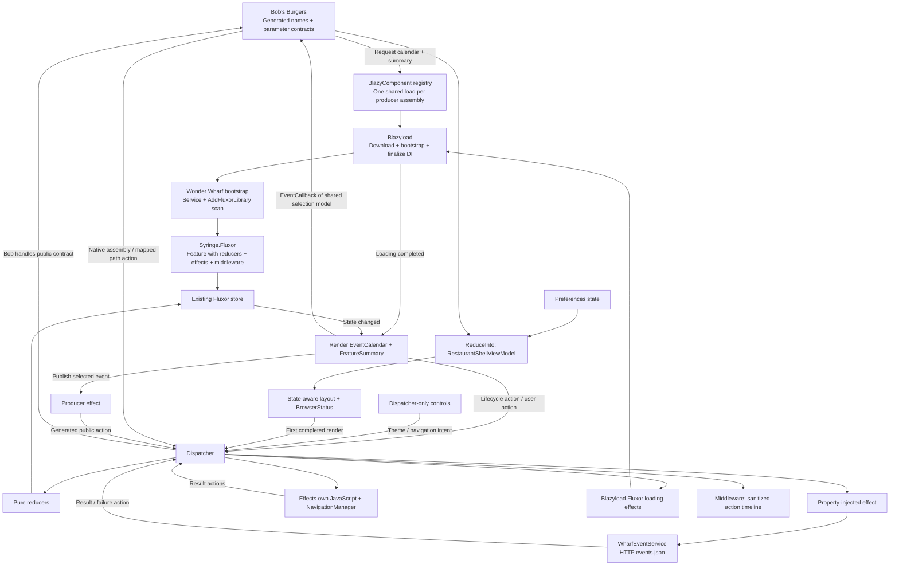

# Fluxor: load a feature, keep the store

Bob's Burgers wants to embed Wonder Wharf's calendar. This time the calendar owns more than UI: it has Fluxor state, actions, reducers, effects, an HTTP service and middleware.

None of Wonder Wharf's implementation is registered at startup. Clicking **Load / mount Wonder Wharf by name** downloads the producer, runs its bootstrap and adds its behavior to the existing Fluxor store. Only then does Components render the calendar.

**This demo is intentionally over-engineered.** A calendar with two events does not need layouts, aggregate state, lifecycle effects, browser interop, an action timeline and multiple loading strategies. Imagine the visible application is about **10% of the final project**: the goal is a repeatable foundation for many features, not the fewest lines needed for this screen.

It is a tech demo for `RonSijm.Blazyload.Components`, Fluxor and its integration libraries, following ConnectPortal's state-aware layouts, dispatcher components, lifecycle orchestration, `[ReduceInto]`, centralized side effects and real-provider tests. Use [Simple](../Simple/README.md) when that foundation would be unnecessary overhead.

```razor
<BlazyComponent Name="@WonderWharfComponents.Events" Parameters="@_parameters" />
<BlazyComponent Name="@WonderWharfComponents.Summary" />
```

Bob references generated contracts, not Wonder Wharf's component, state or service types. The summary and calendar are requested together, come from one assembly and read the same feature state. Bob's own layout composes its restaurant and preferences state; it does not import the producer's private state.

[Open Fluxor](https://ronsijm.github.io/RonSijm.Blazyload.Components/Fluxor/) through the [shared orchestrator](../README.md), or run the standalone host. The live route becomes available when these changes are deployed.

## Run it

From the repository root, with a .NET 10 SDK:

```powershell
dotnet run --project .\Examples\Fluxor\RonSijm.Demo.Blazyload.Components.Fluxor.Host
```

Or run all three examples in one app:

```powershell
dotnet run --project .\Examples\Orchestrator
```

1. Open **Fluxor**. The diagnostics show Wonder Wharf's assembly as **Not loaded** and its feature as **Absent**.
2. Check **Browser module ready** and the first-render count. **Toggle shell theme** updates the preferences feature, the aggregate layout and the actual DOM. **Navigate to the library guide** dispatches navigation intent without reloading the document.
3. Click **Load / mount Wonder Wharf by name**. Both components appear, the feature becomes **Registered**, and the effect retrieves two events.
4. Select **Fall festival**. The calendar and summary see the same selection; a typed callback updates Bob's state and the aggregate shell.
5. Click **Publish selected event to the application**. A separate public action updates Bob's broadcast result. Select another event without publishing: the callback selection changes, but the broadcast result does not.
6. Click **Dispose both components**, then mount them again. The state, selection and successful-load count remain.
7. Click **Simulate service failure**. A failure action puts an explicit error in state without pretending the request succeeded. **Refresh events** performs a new data request.
8. In the orchestrator, switch to Simple and return to Fluxor. The store, theme and selections remain; the new dashboard initially has no mounted calendar. The new shell runs its first-render effect again. Refreshing the browser starts a new app and resets the store.

For the other loading strategies, reload the browser and use **Preload with LoadAssembly** or **Preload with LoadAssemblyForPath** before mounting. The feature becomes registered, but no calendar or summary exists yet and no event-data request is made. Mount afterward to start the data workflow. Reload again to compare the remaining cold-load strategy.

The page displays the store's object identifier, registered feature names, service-call count, load actions, composed values and the last 15 action descriptions. These are runtime values, not hardcoded descriptions of what should have happened.

## What is Fluxor?

Fluxor is a state-management library. Instead of each component maintaining unrelated copies of shared data, a **store** holds state for the running application.

| Term | In this example |
|---|---|
| **Feature** | A named slice of the store, such as `Fluxor.WonderWharf`. |
| **State / ViewModel** | `WonderWharfViewModel`: the current events, loading flag, error and selection. It is shaped for the UI. |
| **Action** | A small typed message describing something that happened or should happen, such as `LoadWharfEvents`. |
| **Dispatcher** | Sends actions to the store. Dispatching is not an HTTP call. |
| **Reducer** | Returns the next state from the previous state and an action. It does not perform HTTP or change the old state object. |
| **Effect** | Performs external work, then dispatches a result action. Here it calls an HTTP service. |
| **Middleware** | Observes dispatches around the normal state/effect flow. Here it counts load actions. |

The state records use `with` expressions to produce new values. Components subscribe to their state and re-render when it changes.



## Which packages do what?

The setup follows the ConnectPortal Fluxor reference: one Blazyload/Syringe composition root, ViewModel components, lifecycle actions and property-injected effects. Unlike that reference, these features really are split into lazy-loaded assemblies.

| Package | Version | Role |
|---|---|---|
| `Fluxor` | `6.11.0` | Store, dispatcher, feature state, actions, reducers, effects and middleware. |
| `Fluxor.Blazor.Web` | `6.11.0` | Root store initialization and automatic component state subscriptions. |
| `Fluxor.Blazor.Web.ReduxDevTools` | `6.11.0` | Browser action/state inspection; enabled only in Debug builds. |
| `RonSijm.Blazyload` | `2.0.1` | Assembly loading, bootstrap and the Syringe-backed service provider. Brought in by Components. |
| `RonSijm.Blazyload.Components` | Repository project | Component names, catalog lookup, shared assembly-load work and dynamic rendering. |
| `RonSijm.Blazyload.Fluxor` | `2.0.1` | `UseFluxor`, native assembly/path loading actions, action-result state and assembly-loaded notifications. |
| `RonSijm.Fluxor.Blazor.Web.Extensions` | `0.0.5` | State-aware components/layouts, dispatcher-only components, lifecycle markers/actions and `PageEffect`. |
| `RonSijm.Syringe.Fluxor` | `1.0.0` | Assembly scanning, property injection, `[ReduceInto]` and adding new Fluxor registrations to the running store. |
| `RonSijm.Blazyload.Components.SourceGenerator` | Repository build tooling | Exports component names, parameter models, public action and feature-loading constants into contracts. |

The demo targets .NET 10. The published Web Extensions package supplies its .NET 9 assets to this compatible .NET 10 application; it does not have its own .NET 10 target yet. No sibling source checkout or local NuGet feed is needed.

**There is no `RonSijm.Blazyload.Components.Fluxor` package.** The existing packages compose without a separate component-specific adapter. Components itself still has no Fluxor dependency.

The shared orchestrator initializes Fluxor because it hosts this example. The standalone Simple and Extensive apps remain Fluxor-free; neither example's feature libraries adopt Fluxor just because the shared host does.

### Benefit to working example

Paths below are relative to this folder. The two feature projects are abbreviated as **Bob** (`RonSijm.Demo.Fluxor.BobsBurgers`) and **Wharf** (`RonSijm.Demo.Fluxor.WonderWharf`).

| Benefit | What you can observe | Code |
|---|---|---|
| Shared, predictable state | Calendar and summary update from the same selection; remounting retains it. | [Wharf ViewModel](RonSijm.Demo.Fluxor.WonderWharf/Redux/WonderWharfViewModel.cs) and [reducers](RonSijm.Demo.Fluxor.WonderWharf/Redux/WharfReducers.cs) |
| Explicit asynchronous workflows | Request, success and failure have separate actions; refresh retries data. | [Wharf effects](RonSijm.Demo.Fluxor.WonderWharf/Redux/WharfEffects.cs) |
| Action-based code loading | Assembly/path preloads register behavior without mounting UI or fetching events. | [Bob preload effect](RonSijm.Demo.Fluxor.BobsBurgers/Redux/PreloadWharfEffect.cs) and [host setup](RonSijm.Demo.Blazyload.Components.Fluxor.Host/Client/Program.cs) |
| Dynamic registration into one store | Store identifier stays the same while the new feature appears. | [Wharf bootstrap](RonSijm.Demo.Fluxor.WonderWharf/Properties/BlazyBootstrap.cs) |
| Managed component subscriptions | Disposal removes component subscriptions, not the shared feature state. | [calendar](RonSijm.Demo.Fluxor.WonderWharf/Components/EventCalendar.razor) and [summary](RonSijm.Demo.Fluxor.WonderWharf/Components/FeatureSummary.razor) |
| State-aware layouts | Theme and both kinds of selection update the application shell. | [Bob layout](RonSijm.Demo.Fluxor.BobsBurgers/Components/RestaurantLayout.razor) |
| Dispatcher-only controls | Command bar dispatches actions without state or browser API injection. | [Bob commands](RonSijm.Demo.Fluxor.BobsBurgers/Components/DemoCommands.razor) |
| Lifecycle orchestration | Initialization requests calendar data; first completed render initializes JavaScript. | [Wharf effects](RonSijm.Demo.Fluxor.WonderWharf/Redux/WharfEffects.cs) and [Bob browser effects](RonSijm.Demo.Fluxor.BobsBurgers/Redux/BrowserEffects.cs) |
| State composition with `[ReduceInto]` | Restaurant and preferences changes reach the shell without handwritten projection reducers. | [Bob aggregate ViewModel](RonSijm.Demo.Fluxor.BobsBurgers/Redux/RestaurantShellViewModel.cs) |
| Effect property injection | HTTP, state, logging, JavaScript and navigation dependencies are resolved by the runtime provider. | [Wharf effects](RonSijm.Demo.Fluxor.WonderWharf/Redux/WharfEffects.cs) and [Bob browser effects](RonSijm.Demo.Fluxor.BobsBurgers/Redux/BrowserEffects.cs) |
| Centralized side effects | Theme changes use an imported JS module; navigation changes the fragment without restarting Blazor. | [Bob browser effects](RonSijm.Demo.Fluxor.BobsBurgers/Redux/BrowserEffects.cs) and [interop service](RonSijm.Demo.Fluxor.BobsBurgers/Services/DemoBrowserInterop.cs) |
| Public application actions | Publishing updates another domain without its reading the producer's private state. | [exported event](RonSijm.Demo.Fluxor.WonderWharf/Models/WharfEventSelected.cs) and [Bob reducers](RonSijm.Demo.Fluxor.BobsBurgers/Redux/RestaurantViewModel.cs) |
| Class and method effect styles | Lazy producer uses typed effects; startup audit logs each loaded assembly through `[EffectMethod]`. | [Wharf effects](RonSijm.Demo.Fluxor.WonderWharf/Redux/WharfEffects.cs) and [startup audit](Shared/AssemblyLoadedAudit.cs) |
| Middleware and diagnostics | Domain/loading/lifecycle actions appear in the Release timeline; Debug DevTools includes state snapshots. | [Bob middleware](RonSijm.Demo.Fluxor.BobsBurgers/Redux/DemoTraceMiddleware.cs) and [timeline](RonSijm.Demo.Fluxor.BobsBurgers/Components/ActionTimeline.razor) |
| Runtime/test provider parity | Component tests use the real factory and dynamically register the same bootstraps. | [Fluxor tests](../../Tests/RonSijm.Blazyload.Components.Tests/FluxorTests.cs) |

This demonstrates the integrations' main application-level benefits, not every optional switch or internal API. It is not a performance benchmark or a recommendation to use Fluxor for every component.

## Project boundaries

```text
Fluxor/
    RonSijm.Demo.Blazyload.Components.Fluxor.Host
    RonSijm.Demo.Fluxor.BobsBurgers
        Components/RestaurantDashboard.razor
        Components/RestaurantLayout.razor
        Components/DemoCommands.razor
        Components/BrowserStatus.razor
        Components/ActionTimeline.razor
        Redux/RestaurantViewModel.cs
        Redux/PreferencesViewModel.cs
        Redux/RestaurantShellViewModel.cs
        Redux/BrowserEffects.cs
        Redux/PreloadWharfEffect.cs
        Redux/DemoTraceMiddleware.cs
        Services/DemoBrowserInterop.cs
        Properties/BlazyBootstrap.cs
        wwwroot/demo.js
    RonSijm.Demo.Fluxor.WonderWharf
        Components/EventCalendar.razor
        Components/FeatureSummary.razor
        Redux/
        Services/WharfEventService.cs
        Models/
        Properties/BlazyBootstrap.cs
        wwwroot/events.json
    Shared/
        AssemblyLoadedAudit.cs
        LoadedAssemblyJsonConverter.cs
```

The **host** is the runnable app. It publishes both Razor Class Libraries (projects containing reusable Razor UI) but delays downloading their implementation assemblies.

The **consumer**, Bob's Burgers, uses a contracts-only reference:

```xml
<BlazyComponentContractReference Include="..\RonSijm.Demo.Fluxor.WonderWharf\RonSijm.Demo.Fluxor.WonderWharf.csproj" />
```

The **producer**, Wonder Wharf, owns its state and behavior. `[BlazyContract]` exports four declarations: `CalendarRequest`, `WharfEventSelection`, the public `WharfEventSelected` message and `WonderWharfFeature` loading constants. Its internal data model, private actions, reducers, effects and services stay in the implementation assembly.

Contracts contain no Fluxor state and have no Fluxor dependency. An action is just a typed C# message, so exporting one does not require exporting its Fluxor handlers. The constants are compile-time strings; their use in startup configuration does not force the implementation or contracts assembly to download eagerly. [Extensive](../Extensive/README.md#where-does-the-contracts-assembly-come-from) explains the generation/export pipeline in more detail.

The logical names start with `fluxor.` so this producer can coexist with the Extensive demo in one catalog. They are not a different kind of component registration.

The orchestrator also defers the ViewModel component helper and `System.Net.Http.Json` until a feature needs them. The common Fluxor store/Blazyload integration still starts once with the host.

## Host setup

Configure the host before `builder.Build()`:

```csharp
builder.Services.AddScoped(_ => new HttpClient
{
    BaseAddress = new Uri(builder.HostEnvironment.BaseAddress)
});

builder.UseBlazyload(options =>
{
    options.LoadOnNavigation(WonderWharfFeature.LoadingPath, $"{WonderWharfFeature.AssemblyName}.wasm");
    options.UseFluxor(fluxor =>
    {
        fluxor.ScanAssemblies(typeof(Program).Assembly);
#if DEBUG
        fluxor.AddNativeExtension(native => native.UseReduxDevTools(settings =>
        {
            settings.Name = "Components + Fluxor";
            settings.JsonSerializerOptions.Converters.Add(new LoadedAssemblyJsonConverter());
            settings.AddActionFilter(action =>
                action.GetType().Namespace?.StartsWith("RonSijm.Demo.", StringComparison.Ordinal) == true);
        }));
#endif
    });
});
builder.Services.AddBlazyloadComponents();
```

The HTTP client needs an application base address for the feature's relative asset URL. `AddBlazyloadComponents` supplies a client when none is registered, but does not configure an application's HTTP endpoints for it.

The host scans **only its own startup assembly**. Do not scan `typeof(EventCalendar).Assembly` at startup: that uses the producer's implementation type, defeats the example's loading boundary and can register the feature twice.

Place `<Fluxor.Blazor.Web.StoreInitializer />` at the root of `App.razor`, once per running application, not inside each dynamically rendered component. It initializes the store and surfaces unhandled effect errors through Blazor. A `.razor` file whose namespace includes `Fluxor` can import `global::Fluxor.Blazor.Web` and use `<StoreInitializer />` to avoid a namespace-name collision.

The host has normal producer references for publication, generated contracts references, manifest generation and `BlazorWebAssemblyLazyLoad` entries. In this repository, `Directory.Build.targets` wires the local source-generator tooling. In your own projects, install the generator package in producer and contracts-only consumers/hosts as described in the [main setup](../../README.md#generate-contracts-without-maintaining-another-project).

## Dynamic registration

Wonder Wharf's bootstrap contains the registration, not Bob's Burgers:

```csharp
var services = new ServiceCollection();
services.AddSingleton<WharfEventService>();
services.AddFluxorLibrary(options =>
{
    options.ScanAssemblies<BlazyBootstrap>();
    options.AddMiddleware<WharfTraceMiddleware>();
});
```

`AddFluxorLibrary` discovers both `[ReducerMethod]` methods and `Reducer<TState, TAction>` classes, and attaches them when constructing the feature. Syringe then adds that feature, its effects and middleware to the existing store during provider finalization.

The loader completes this registration before Components returns the component type. The calendar can therefore resolve `IState<WonderWharfViewModel>` and dispatch its first action immediately. There is no polling loop, second store or component-side registration handshake.

Simultaneous named components from this assembly share one loader task in their registry. This avoids downloading/bootstrap-registering the same producer twice while its first load is still pending. Direct calls to core's loading/navigation API and separate registries are outside that sharing.

The dashboard observes the integration's public `AssemblyLoaded` action in its own reducer and shows the store's feature names. It does not inject Wonder Wharf's state.

### Three ways to request the same code

Name-based mounting goes through Components' registry. Native preloading instead dispatches:

```csharp
Dispatcher.Dispatch(new LoadAssembly("RonSijm.Demo.Fluxor.WonderWharf.wasm"));
Dispatcher.Dispatch(new LoadAssemblyForPath("fluxor/wharf"));
```

The first requests an assembly directly. The second resolves the mapping configured by `LoadOnNavigation`; **`fluxor/wharf` is a logical loading path, not another page or route in this demo**. Dispatching it does not navigate the browser.

In Blazyload.Fluxor 2.0.1, `LoadAssemblyEffect` dispatches its returned `List<Assembly>`, which updates the built-in `AssembliesLoadedState`. Loading through Components emits `AssemblyLoaded` notifications but does not go through that action effect. Consequently, the dashboard shows both its notification-based availability projection and the native action-result state. An empty native result after name-based mounting is not a loading failure.

Preloading and mounting have different lifetimes: registration makes the feature available; mounting starts component lifecycle work. The UI disables competing loading controls while one strategy is pending. Components shares work within its registry, not across every direct core/Fluxor loading call.

### Effect styles and a version limitation

Typed `Effect<TAction>` classes join the store dynamically and have property-injected dependencies. Both the calendar's HTTP workflow and its public-event publication use that style.

The host also includes a startup `[EffectMethod]` audit with constructor-injected logging. It records completed assembly registrations in the browser console without depending on a demo implementation type.

**Syringe.Fluxor 1.0.0 does not dynamically attach method-effect wrappers.** Scanning a lazy class with `[EffectMethod]` registers its host object, but the dynamic after-build wiring only adds effect services implementing `IEffect`. It does not recreate those method wrappers. Startup store construction does, so the demo shows method effects there rather than pretending they work in a lazy producer. Resolving the method's host object alone does not prove the method will handle dispatched actions.

## Components, lifecycle and effects

`EventCalendar` inherits `ViewModelComponent<WonderWharfViewModel>`. That base supplies the current ViewModel, dispatcher and state subscription.

The ViewModel implements `IDispatchOnInitialized`. The component base dispatches a `PageEvent` during initialization. `CalendarInitializedEffect`, a `PageEffect<EventCalendar>`, handles only this calendar's initialization and requests data if it has not already loaded and no request is pending.

### Components and layouts have different jobs

| Base class | Demo use | Responsibility |
|---|---|---|
| `ViewModelComponent<T>` | Calendar, summary, dashboard, browser status and timeline | Reads its feature state, dispatches intent and manages subscriptions. |
| `FluxorDispatcherComponent` | `DemoCommands` | Dispatches actions without owning a typed feature-state subscription. |
| `ViewModelLayout<T>` | `RestaurantLayout` | Makes application chrome follow an aggregate ViewModel. |

The layout's command bar receives a simple busy flag. It does not inject `NavigationManager` or `IJSRuntime`. The effects own those APIs, so UI markup expresses intent rather than implementing external work.

### Compose state instead of copying reducers

Bob's shell needs restaurant selection and preferences together:

```csharp
[FeatureState(Name = "Fluxor.Shell")]
public sealed record RestaurantShellViewModel
{
    [ReduceInto]
    public RestaurantViewModel? Restaurant { get; init; }

    [ReduceInto]
    public PreferencesViewModel? Preferences { get; init; }
}
```

`[ReduceInto]` creates projection reducers. When either child feature changes, the convention puts its new value into a new shell ViewModel. The layout subscribes to that aggregate instead of manually subscribing to both features or duplicating every child reducer.

Use normal `[ReducerMethod]` methods for business transitions. Composition is a deliberate read model for the UI, not permission for one domain to modify another's private state. Here both projected features belong to Bob; Wonder Wharf's state remains private.

### Browser work after the DOM exists

`PreferencesViewModel` implements `IDispatchFirstTimeOnAfterRender`. Its `BrowserStatus` component dispatches the corresponding `PageEvent` after its first render. `ShellFirstRenderedEffect : PageEffect<BrowserStatus>` handles only that source and phase, imports `demo.js` and initializes the shell theme.

**Initialization and first render are not interchangeable.** HTTP data loading does not need rendered DOM elements. JavaScript that finds the shell does. The JS module explicitly fails if the shell is absent; expected JS failures are logged and displayed in state.

The interop service caches one module for the application lifetime and disposes it with the service. Mounting a new shell runs its first-render effect again using that module and the current preferences. Theme success updates state only after JS succeeds; failure retains the previous theme and clears the busy flag.

The package also offers later-render lifecycle dispatch. This demo deliberately does not update global state after every render: that can create a render/action loop. Lifecycle actions are useful for observable orchestration, not mandatory replacements for every Blazor lifecycle override.

`LoadWharfEventsEffect` uses Syringe's property injection:

```csharp
[Inject] public WharfEventService Service { get; set; } = null!;
[Inject] public ILogger<LoadWharfEventsEffect> Logger { get; set; } = null!;
```

Ordinary Microsoft DI does not inject arbitrary properties on effect classes. This works because the host uses the configured Blazyload/Syringe provider. Do not replace that provider in tests and assume the same behavior will survive.

The service reads the producer's `_content/RonSijm.Demo.Fluxor.WonderWharf/events.json`. This is a tiny static HTTP payload, not a backend API. The effect dispatches success or a logged failure action. Refreshing retries **data retrieval**, not an assembly load or failed bootstrap.

Selecting an event has two meanings: a private action updates Wonder Wharf's own selection, and an `EventCallback<WharfEventSelection>` reports it to Bob. Bob dispatches its own `RecordWharfSelection` action. Neither domain consumes the other's private state or actions.

### A callback is not an application-wide event

The separate publish button dispatches private `PublishSelectedWharfEvent`. `WharfSelectionEffect` reads the producer's selection and dispatches exported `WharfEventSelected`. Bob handles that public contract in its own reducer; another interested domain could do the same.

The callback reports UI interaction to the parent that rendered the calendar. The public action broadcasts an intentional application message to the store's registered handlers. Changing selection afterward does not silently publish again. These are in-memory application messages, not a backend message bus or cross-browser notifications.

### Diagnostics without dispatch loops

`DemoTraceMiddleware` keeps the last 15 action descriptions in `TraceViewModel`. It records domain actions and sanitized loading/lifecycle messages; it never stores `Assembly` or `Type` objects in its own state.

It ignores its own `ActionObserved` actions and feature-state values emitted by the projection convention. Otherwise recording an action could create another recorded action indefinitely. The producer's separate middleware counts only its data-load actions.

## Lifetime and limits

Disposing a component removes its state subscriptions. It does not unload the assembly, remove effects/services/middleware or delete the feature's state. These registrations live for this application session.

Reopening the calendar uses that state and does not automatically repeat a successful data load. Refreshing the browser creates a new runtime and store. This example does **not** persist anything to local or session storage, and does not use reflection-based effect removal.

The hosts preserve both demo feature assemblies and the Blazyload.Fluxor assembly during Release trimming with `TrimmerRootAssembly`. **Trimming** removes code the compiler thinks is unused; reflection-based Fluxor scanning can need types that are not called directly. Preserving these small demo assemblies favors a reliable example over maximum size reduction. It does not make all features eager downloads.

Redux DevTools registration is compiled into Debug startup only. Install the browser extension to inspect action history. Release builds do not enable that state-inspection middleware.

The Debug action filter records the demo's domain actions, not infrastructure/lifecycle actions containing reflection objects such as `Assembly` or `Type`. Redux DevTools serializes actions and state as JSON; reflection objects are not normal JSON data. The dashboard's load projection stores assembly **names**. The native integration state contains `Assembly` objects, so the shared `LoadedAssemblyJsonConverter` represents those as full identity strings in Debug snapshots. Restoring an identity only resolves an already-loaded assembly; the converter cannot download code.

Initialization still dispatches lifecycle actions normally. The in-page middleware timeline shows their sanitized descriptions even though the native DevTools action filter excludes their raw reflection-bearing payloads.

DevTools history does not unload a dynamically registered feature. A snapshot taken before registration cannot turn the app back into one where its code was never loaded.

There is no feature-unload API, runtime package installation, automatic assembly retry or server-rendering/AOT claim here.

## Compare and verify

[Simple](../Simple/README.md) keeps component composition minimal. [Extensive](../Extensive/README.md) explains generated contracts and normal component parameters, callbacks, services and assets. Fluxor adds explicit shared state and workflows; none of those extra packages are prerequisites for Components.

Tests follow ConnectPortal's runtime/test parity:

```csharp
var options = new BlazyloadProviderOptions();
options.UseFluxor(fluxor => fluxor.ScanTypes(typeof(StartupState)));
context.Services.UseServiceProviderFactory(new BlazyServiceProviderFactory(options));
```

bUnit supplies controlled browser services, but the actual Blazyload/Syringe factory still performs dependency injection and dynamic registration. This catches mistakes that a plain `BuildServiceProvider()` setup would miss. Pure reducers are also tested independently.

From the repository root:

```powershell
dotnet test .\Tests\RonSijm.Blazyload.Components.Tests --filter FullyQualifiedName~FluxorTests
.\Verify-Publish.ps1 -Demo Fluxor
.\Verify-Publish.ps1 -GitHubPages
```

The focused tests verify dynamic registration, aggregate projections, public actions, startup method effects, lifecycle filtering, JS failure, navigation, trace limits and native preload intent. The published-browser scenario exercises actual JavaScript, theme/state composition, callbacks versus public actions, HTTP success/failure, disposal and all three cold-load paths. It verifies that preloading makes no event-data request and that later mounting downloads no second implementation copy. The orchestrator also checks navigation/return without another document/runtime, direct links and browser-reset behavior.

For a separately published **Debug** host, set `BLAZY_COMPONENTS_VERIFY_REDUX_DEVTOOLS=true` along with the integration test's publish-root/base-path/demo settings. The browser test then supplies a small Redux DevTools connection stub and asserts that the real middleware sends domain actions and serialized state snapshots. Release runs assert that no DevTools connection is made.
