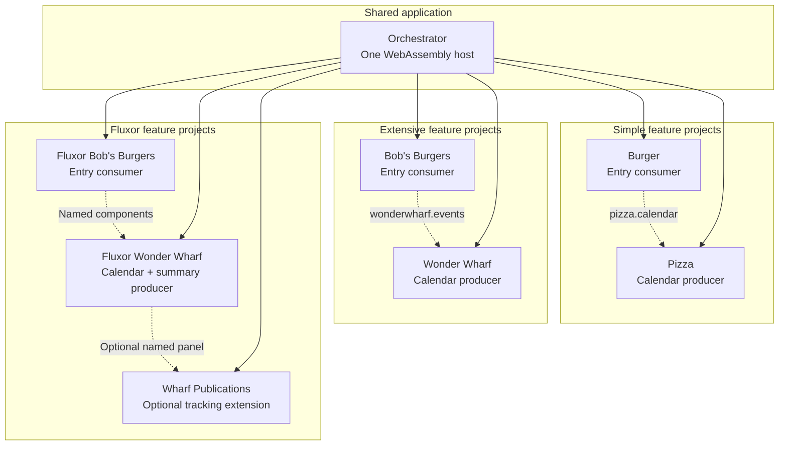

# Orchestrator: three lazy demos, one Blazor app

The orchestrator is a demo in its own right, not just a menu linking to three websites. It shows how one Blazor WebAssembly application can host independently developed features and load their entry components by name.

**WebAssembly** runs the .NET application in the browser. Choosing Simple, Extensive or Fluxor changes the displayed components inside that running application. It does not open another Blazor host, use an iframe or download and start another .NET runtime.

The shared host owns navigation, component loading, dependency injection (DI) and the Fluxor store. Each demo owns its UI and feature behavior. That is the useful application pattern here: a small shared shell can compose larger features without putting their implementation types into the shell's Razor code.

[Open the live orchestrator](https://ronsijm.github.io/RonSijm.Blazyload.Components/) or read the [example overview](../README.md) to compare the three demos.

## Run locally

From the repository root, with a .NET 10 SDK:

```powershell
dotnet run --project .\Examples\Orchestrator
```

Open the address printed by the development server. The repository uses NuGet.org for package restore; no sibling Blazyload or Syringe source checkout is required.

The home page displays the shared navigation/router and the three route-to-component-name branches, with an explanation of catalog lookup, lazy loading and rendering inside the existing app. These are excerpts from `App.razor` and `DemoPage.razor`, not a second orchestration implementation.

## How the demo projects fit together

The project names below are shortened to keep the diagram readable. Each box inside a demo group represents that demo's UI project, not a separate website.

**Solid arrows** are the orchestrator's project references: the host builds and publishes those feature libraries. **Dotted arrows** are component-name requests at runtime, not project references between the consumer and producer.



A **consumer** displays a component supplied by a **producer**. Burger can ask for `pizza.calendar` without referencing the Pizza implementation project; it references shared contracts instead. The same separation applies to Bob's Burgers and Wonder Wharf.

The orchestrator's project references make all seven UI libraries available for the build, catalog generation and publication. They do **not** mean the browser downloads them at startup: the host's project file explicitly marks their assemblies as lazy.

Each demo also has a standalone `.Host` project for studying it independently. The orchestrator does not reference or start those hosts. It reuses their feature libraries inside its own application.

### Entry points and supporting projects

An **entry component** is the first component the orchestrator displays for a demo. That component can later request its own producer components.

| Route | Entry component name | Demo guide |
|---|---|---|
| `Simple/` | `burger.editor` | [Simple: Burger and Pizza](../Simple/README.md) |
| `Extensive/` | `bobsburgers.dashboard` | [Extensive: Bob's Burgers and Wonder Wharf](../Extensive/README.md) |
| `Fluxor/` | `fluxor.bobsburgers.dashboard` | [Fluxor: a stateful feature foundation](../Fluxor/README.md) |

The diagram groups the UI projects and leaves these supporting assemblies out of the main graph:

| Demo | Supporting assemblies | Purpose |
|---|---|---|
| Simple | `Pizza.Contracts`, `Pizza.Services` | Handwritten shared models and the producer's service dependency. |
| Extensive | `WonderWharf.Contracts`, `WonderWharf.Services` | Generated shared models and names, plus the producer's event-service dependency. |
| Fluxor | `Fluxor.WonderWharf.Contracts` | Generated shared models, names and public actions; its services, state, reducers and effects live in the producer implementation. |

The actual assembly names have the `RonSijm.Demo...` prefixes shown in the [orchestrator project file](RonSijm.Demo.Blazyload.Components.Orchestrator.csproj). Together, the seven UI assemblies and five supporting assemblies are the **twelve lazy feature assemblies**.

Publications is an optional extension owned by Wharf, not another independent domain. It references Wharf's implementation state. Load its panel from the Fluxor summary to see late registration, visible preparation failure, corrected retry and duplicate coalescing; the ordinary Wharf load does not download or register it.

**Contracts** are small shared C# types and identifiers, not the producer's UI implementation. Simple maintains them by hand; Extensive and Fluxor export them with the optional SourceGenerator during the build. The generator does not run in the browser.

Unlike the standalone hosts, the orchestrator defers these contracts too. Its Razor code requests entry components by name rather than constructing their model objects. A selected entry's contracts arrive when needed; the producer's later UI and service request can still remain deferred.

## What happens when you choose a demo?

The host uses the same API that a consuming application would use:

```razor
<BlazyComponent Name="burger.editor" />
```

1. Blazor routes the selection to `DemoPage.razor`, which chooses the entry component name.
2. Components looks that name up in `blazy-components.json`, the component catalog generated during the build. The catalog maps names to assemblies and component types; reading it does not execute a feature.
3. Blazyload downloads the required assembly and dependencies. It runs the feature's **bootstrap**, the code that registers services with the running DI container. For a Fluxor feature, registration also connects its state, reducers and effects to the existing store.
4. Components renders the entry component. The entry's own controls can later ask for Pizza or Wonder Wharf through another `<BlazyComponent>`.

All entry and producer requests share the host's loading infrastructure. Already-loaded code is reused; choosing another demo does not create another application.

Simple's parameter/callback composition and Extensive's generated-contract composition do not require Fluxor. The combined host initializes a store because the third demo uses it. That does not add Fluxor dependencies to the Simple/Extensive feature libraries or their standalone hosts.

The orchestrator also defers `RonSijm.Fluxor.Blazor.Web.Extensions` and `System.Net.Http.Json`, which are needed by lazy feature code. Those dependency downloads are not additional Blazor runtimes.

## Switching demos: code lifetime is not UI-state lifetime

Leaving a demo removes its mounted components, but does not unload its assemblies or undo its service registrations.

| Item | Leave a demo and return | Refresh the browser |
|---|---|---|
| WebAssembly runtime | The same runtime continues running. | A new application starts. |
| Downloaded feature code | Assemblies remain loaded; no second feature download is needed. | The new app loads what it needs, possibly from the browser's HTTP cache. |
| Service registrations | Remain available; service instances follow their registered DI lifetimes. | The new app registers services again. |
| Component-local fields | Fresh component instances reset Simple/Extensive's local title and selection. | Reset with the new app. |
| Fluxor state | The shared store retains feature data and event selection. | A new store starts; this demo does not persist it across reloads. |

This is why the orchestrator demonstrates more than a menu: it makes the distinction between loading code, mounting components and retaining application state visible.

## Watch the loading behavior

Open browser DevTools (**F12**), select **Network**, enable **Disable cache** and reload the home page. Filter requests by `RonSijm.Demo`.

Choose a demo to see Burger or one of the Bob's Burgers assemblies arrive. Then use that demo's loading button to request Pizza or Wonder Wharf. Switch demos through the header, then return to one you already opened.

The initial home page does not download demo implementation assemblies. Navigation inside the app does not request another HTML document or restart the runtime. Returning to a loaded demo does not download its assemblies again.

In .NET 10 these assemblies are served as `.wasm` files. Filenames can include a **fingerprint**, a content-based identifier for caching, so filter by part of the project name rather than one exact filename.

Scoped component styles are bundled into the host's stylesheet. CSS arriving at startup is not evidence that the corresponding component assembly has downloaded.

The shared `AssemblyLoadedAudit` method effect logs completed lazy registrations in the browser console. Debug builds also enable Redux DevTools; Release builds do not enable that integration. See the [Fluxor guide](../Fluxor/README.md) for its action/state inspection walkthrough.

The host explicitly selects a singleton store for this WebAssembly application session. Syringe also supports scoped stores; the focused tests exercise registrations across existing and future scopes. The shared store lifetime here is intentional application configuration, not a package restriction.

## Direct links and publication

Publish from the repository root:

```powershell
dotnet publish .\Examples\Orchestrator -c Release

# For this repository's GitHub Pages subdirectory:
dotnet publish .\Examples\Orchestrator -c Release -p:GHPages=true
```

The website is written to `Examples\Orchestrator\bin\Release\net10.0\publish\wwwroot`.

GitHub Pages serves static files, so a direct request for `/Extensive/` needs a file at that path. Publication copies the **same** startup `index.html` into the `Simple`, `Extensive` and `Fluxor` folders. Their `<base href>` still points to the shared application's root, so they use the same framework files, catalog and assets.

These copies are not three separately published Blazor hosts. Following an in-app link keeps the current runtime; opening a direct link or refreshing starts a new app, as normal browser navigation does.

## Source map

| File | Responsibility |
|---|---|
| [Client/Program.cs](Client/Program.cs) | Configures Blazyload, Components, the shared Fluxor store and Debug-only Redux DevTools. |
| [App.razor](App.razor) | Initializes the store and supplies the shared navigation and router. |
| [Pages/DemoPage.razor](Pages/DemoPage.razor) | Maps the selected route to a component-name request. |
| [Orchestrator project file](RonSijm.Demo.Blazyload.Components.Orchestrator.csproj) | References feature projects, marks assemblies lazy, generates the catalog and configures route copies for publication. |
| [AssemblyLoadedAudit.cs](../Fluxor/Shared/AssemblyLoadedAudit.cs) | Logs assembly-registration notifications through a startup method effect, shared with the standalone Fluxor host. |

For the published-browser verification commands, see [Verify publication](../README.md#verify-publication). For installing the libraries in your own application, see the [library README](../../README.md).
