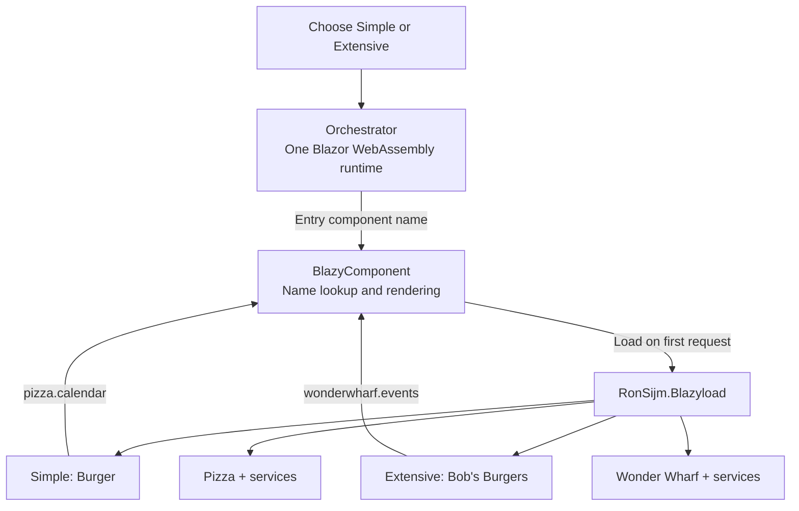

# Two demos, one Blazor host

Two domains have built different demos. I want to show both in one Blazor website, without restarting WebAssembly every time someone changes demos.

Here a **domain** just means a group of related feature code, such as Burger/Pizza or Bob's Burgers/Wonder Wharf. Each demo supplies a component that another app can display.

The **orchestrator** is that app: a small Blazor WebAssembly website with a menu for choosing a demo. WebAssembly runs the .NET application in the browser. Keeping one running app avoids downloading and starting another Blazor runtime when you switch demos.

Run it from the repository root, with a .NET 10 SDK:

```powershell
dotnet run --project .\Examples\Orchestrator
```

The [live site](https://ronsijm.github.io/RonSijm.Blazyload.Components/) uses this host. [Simple](https://ronsijm.github.io/RonSijm.Blazyload.Components/Simple/) and [Extensive](https://ronsijm.github.io/RonSijm.Blazyload.Components/Extensive/) are routes in that same app, not separate WebAssembly applications.

## Choose a demo

Both examples compose a component from another library without referencing its implementation from the consumer.

**Producer** means the library supplying a component; **consumer** means the feature displaying it. Composition here means rendering that component inside the consumer's UI, not opening another website or an iframe.

| Demo | Use case | Setup |
|---|---|---|
| [Simple](Simple/README.md) | "I want this composition, but not an over-complicated setup." | The original Burger/Pizza example: component names, ordinary parameters and callbacks. No source generator. |
| [Extensive](Extensive/README.md) | Show how the pieces work together in a larger application. | A technical sales-style page: visible consumer/producer code, generated names and contracts, services, assets and loading steps. |

Start with **Simple** if you want as few changes and dependencies as possible. Generated contracts are optional; you don't need to adopt them to compose components by name.

**Contracts** are shared C# types and names, kept separate from the component's UI code. Simple maintains a small shared-model project by hand. Extensive generates that library from marked producer source. Both demos already support parameters, callbacks, services and static assets; those don't require a source generator.

The feature code is deliberately small and ugly. These demos aren't examples of how to structure an entire business application.

## What does the orchestrator do?

It asks for each demo's first component, called its **entry component**, by name:

```razor
<!-- Simple -->
<BlazyComponent Name="burger.editor" />

<!-- Extensive -->
<BlazyComponent Name="bobsburgers.dashboard" />
```

The feature projects compile into **assemblies**: .NET libraries containing their component and service types. The orchestrator includes them in the published website but marks all eight feature assemblies as **lazy**, so the browser waits to download them until they're needed.

It also generates a **component catalog**, `blazy-components.json`, mapping friendly names to assemblies and component types. Reading that file doesn't execute the components. The orchestrator's own Razor code doesn't need either demo's implementation types.

1. The site starts one WebAssembly runtime. No demo implementation has been downloaded.
2. Choosing **Simple** loads Burger. Choosing **Extensive** loads Bob's Burgers.
3. The demo's own button asks for Pizza or Wonder Wharf, including its service dependency.
4. Switching demos changes the displayed component through Blazor routing, without requesting another HTML document. The existing .NET runtime, loaded assemblies and registered services remain.

Already-loaded assemblies aren't downloaded again. Going back to a demo creates a fresh component instance, so its title/date selection resets. Remembering downloaded code is different from remembering the state of the UI created from that code.

The orchestrator doesn't construct either demo's model objects, so their contracts can wait until the selected entry component needs those types. The standalone hosts instead load contracts at startup.

Scoped styles are the CSS from files such as `EventCalendar.razor.css`, bundled into the host's stylesheet. That stylesheet can load at startup even while the component assembly waits. Seeing CSS arrive isn't evidence that all the feature code has downloaded.



Direct links and browser refreshes work too. GitHub Pages serves static files, so a request for `/Extensive/` needs an HTML file at that path. Publication copies the **same startup HTML**, `index.html`, into the `Simple` and `Extensive` folders. Both copies point at the root app's assets; Blazor then selects the appropriate route.

Switching through the site's navigation keeps the running app. Refreshing the page or opening a direct link starts a new app, as it normally would; the copied HTML doesn't preserve the previous runtime.

## Run a demo on its own

From the repository root, with a .NET 10 SDK:

```powershell
# Simple
dotnet run --project .\Examples\Simple\RonSijm.Demo.Blazyload.Components.Simple.Host

# Extensive
dotnet run --project .\Examples\Extensive\RonSijm.Demo.Blazyload.Components.Extensive.Host
```

These standalone hosts remain for studying each example independently. All three hosts use separate development ports. Pages deploys only the orchestrator.

## Watch the downloads

Open browser DevTools (**F12**), select **Network**, disable caching and reload the orchestrator's home page. Filter for `RonSijm.Demo`, then choose a demo and use its button.

Watch Burger or Bob's Burgers arrive first, then Pizza or Wonder Wharf. Switch demos using the site's navigation: there is no second document or Blazor startup, and returning to a loaded demo doesn't fetch its assemblies again.

In .NET 10 these DLL assemblies are served as `.wasm` files. Names often include a **fingerprint**, a content-based identifier used for browser caching, so filter by part of the feature name rather than an exact filename.

In this host, shared contracts arrive with Burger or Bob's Burgers, not with Pizza or Wonder Wharf's later UI request. Enable **Disable cache** and reload to observe a fresh load; simply navigating away doesn't unload the assemblies already in memory.

## Which package do I need?

**RonSijm.Blazyload** downloads feature assemblies and their dependencies. It runs the feature's **bootstrap**, the service-registration code that makes its services available through dependency injection (DI), including `@inject`. It also works by itself for lazy-loaded pages.

**RonSijm.Blazyload.Components** adds name-based component rendering, parameters, callbacks and the generated component catalog. It depends on Blazyload.

**RonSijm.Blazyload.Components.SourceGenerator** runs during the build to generate names and create a shared-model library. Its generator and exporter don't run in the browser, but the resulting contracts library is part of the app. Extensive uses it; Simple doesn't.

See the [library README](../README.md) for package setup and APIs.

## Verify publication

From the repository root:

```powershell
.\Verify-Publish.ps1
.\Verify-Publish.ps1 -GitHubPages
.\Verify-Publish.ps1 -Demo Simple
.\Verify-Publish.ps1 -Demo Extensive
.\Verify-Publish.ps1 -Demo All
```

By default the script publishes the orchestrator and checks both demos, navigation/history, direct links and that switching doesn't reload the document, runtime assets or feature assemblies. `Simple` and `Extensive` check their standalone hosts; `All` checks all three hosts.

The GitHub Pages workflow publishes and checks the orchestrator, then deploys its single `wwwroot`. That is the published folder containing the startup HTML, .NET code, catalog and static assets the web server must serve.
