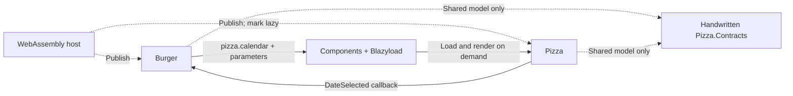

# Simple: Burger, Pizza and component composition

> I want this composition, but I don't want an over-complicated setup. Keep it minimal, with as few changes and dependencies as possible.

That is the use case for this demo. It preserves the original Burger/Pizza example, without a storefront, generated component identifiers or a contracts-export pipeline.

Burger wants to embed Pizza's calendar without referencing Pizza's implementation:

```razor
<BlazyComponent Name="pizza.calendar" Parameters="@_parameters" />
```

That's the composition. The host includes Pizza for deployment; Blazyload downloads it when Burger asks for it.

The **host** is the runnable Blazor WebAssembly app: it owns startup and the files published to the website. **Burger** is the consumer, displaying another library's component. **Pizza** is the producer, implementing that component. They are feature names, not separate websites.

The feature projects are Razor Class Libraries: reusable projects containing `.razor` UI and optional static files. They compile into assemblies containing the C# types. Lazy loading delays downloading those assemblies; it doesn't download individual Razor source files.

[Open Simple](https://ronsijm.github.io/RonSijm.Blazyload.Components/Simple/) or [compare with Extensive](../Extensive/README.md).

The live site renders this demo inside the [shared orchestrator](../README.md#what-does-the-orchestrator-do). Switching to Extensive uses the same Blazor runtime; it doesn't start another app. Simple's feature projects don't gain any generated-contract dependencies because of this.

## Run it

To run Simple by itself, use this standalone host from `Examples\Simple`, with a .NET 10 SDK:

```powershell
dotnet run --project .\RonSijm.Demo.Blazyload.Components.Simple.Host
```

1. The **Burger editor** appears.
2. Click **Show pizza calendar**.
3. The calendar shows **Pizza for burgers** and **Burger customer**.
4. Click **Select pizza date** to send `2026-10-01` back to Burger.
5. Click **Change calendar title** to update the existing calendar.

Both features are deliberately small and ugly. Styling and unrelated application code aren't the point.

## What do I have to change?

In your own application, run this in the host project and each feature project that declares or renders named components:

```powershell
dotnet add package RonSijm.Blazyload.Components
```

It brings Blazyload with it. You do **not** need `RonSijm.Blazyload.Components.SourceGenerator`, `[BlazyContract]`, generated headers or `BlazyComponentContractReference`.

Wire up the existing WebAssembly host:

```csharp
using RonSijm.Blazyload;
using RonSijm.Blazyload.Components;

builder.UseBlazyload();
builder.Services.AddBlazyloadComponents();
```

Add those calls to `Program.cs` before `builder.Build()`. The first sets up assembly loading and service registration; the second adds the name lookup and rendering services.

Give the producer a stable name:

```razor
@using RonSijm.Blazyload.Components
@attribute [BlazyComponent("pizza.calendar")]
```

The attribute gives the component a stable name. During the build, Components records that name, assembly and component type in a **catalog** called `blazy-components.json`. You can think of it as a lookup file, not executable feature code.

The build also tells the publish-time **trimmer** to keep the annotated component. Trimming removes apparently unused code; a type selected through a string name can otherwise look unused. The attribute isn't a permission check. Names are case-sensitive and must be unique.

Add a project or package reference to Pizza **from the host**, so its code and assets are published. Then add this to the host's `.csproj` to keep the implementation out of the startup downloads:

```xml
<ItemGroup>
  <BlazorWebAssemblyLazyLoad Include="RonSijm.Demo.Blazyload.Components.Pizza.wasm" />
</ItemGroup>
```

The `.wasm` filename is the .NET 10 assembly asset; `"pizza.calendar"` is the separate friendly component name. The host includes the assembly for deployment, but Burger doesn't need a reference to Pizza's UI types.

Then render it by name from Burger. The Components package generates the host's catalog; you don't write a manifest yourself. "Manifest" is another name for that same catalog. This repository uses source-project references and enables generation explicitly in the sample host.

## Why are there still contracts and services projects?

The old demo also passes a model object, uses dependency injection (DI) and loads static assets. DI is how Blazor supplies a service requested through `@inject` or constructor injection. These are examples, not mandatory layers for name-based composition:

| Project | Purpose |
|---|---|
| `.Simple.Host` | Startup, deployment references and lazy-assembly configuration |
| `.Burger` | Consumer component and callback handler |
| `.Pizza` | Calendar implementation |
| `.Pizza.Contracts` | One handwritten `PizzaCalendarModel` record shared by both features |
| `.Pizza.Services` | A greeting service, registered by Pizza's existing Blazyload bootstrap |

The feature-project names start with `RonSijm.Demo.Blazyload.Components`. Burger references Components and the tiny contracts project, **not** Pizza or Pizza.Services.

The **contracts** project contains the shared record, not the calendar's UI. Both Burger and Pizza reference it so they use the same compiled `PizzaCalendarModel` type. Copying the same record declaration into each feature would create two different .NET types; matching property names aren't enough.

The **bootstrap** is the code Blazyload calls after a feature loads to register its services. That is useful because Pizza wasn't present when the host originally ran its startup code. Burger doesn't need to register Pizza's service itself.

If you only pass primitive values and callbacks, you don't need a model contracts project. If the producer has no injected feature services, you don't need a service project or bootstrap either. The image and JavaScript aren't required for composition; they're here to demonstrate that normal Razor Class Library assets still work.



## Parameters and callbacks

Blazor parameters are properties marked `[Parameter]` on the target component. Normally you'd set them on a tag such as `<PizzaCalendar Title="Pizza for burgers" />`. Without the implementation reference, Burger instead supplies the property names and values in a dictionary:

```razor
@using Microsoft.AspNetCore.Components
@using RonSijm.Blazyload.Components
@using RonSijm.Demo.Blazyload.Components.Pizza.Contracts

<BlazyComponent Name="pizza.calendar" Parameters="@_parameters" />
<p>@_selectedDate</p>

@code {
    private Dictionary<string, object?> _parameters = [];
    private string? _selectedDate;

    protected override void OnInitialized()
    {
        _parameters = new Dictionary<string, object?>
        {
            ["Title"] = "Pizza for burgers",
            ["Model"] = new PizzaCalendarModel("Burger customer"),
            ["DateSelected"] = EventCallback.Factory.Create<DateOnly>(this, HandleDateSelected)
        };
    }

    private void HandleDateSelected(DateOnly date)
    {
        _selectedDate = date.ToString("yyyy-MM-dd");
    }
}
```

This standalone snippet requests Pizza immediately when rendered. The demo waits for **Show pizza calendar** before filling the dictionary and rendering `<BlazyComponent>`.

The dictionary entries do the following:

- `"Title"` sets the calendar's string property.
- `"Model"` passes the shared object directly; no JSON conversion or network API is involved.
- `"DateSelected"` supplies a typed callback that the calendar can invoke.

`EventCallback.Factory.Create<DateOnly>(this, HandleDateSelected)` connects the callback to this consumer component and its handler. Pizza sends a `DateOnly` by calling `DateSelected.InvokeAsync(date)`; `HandleDateSelected` stores it, and Blazor updates the displayed value.

Pizza declares its matching properties like this:

```csharp
[Parameter]
public string Title { get; set; } = "Pizza calendar";

[Parameter]
public PizzaCalendarModel? Model { get; set; }

[Parameter]
public EventCallback<DateOnly> DateSelected { get; set; }
```

The demo's **Change calendar title** button replaces the dictionary with an updated one. Blazor updates the existing calendar without downloading its assembly again.

The tradeoff is runtime checking. `"Titel"` instead of `"Title"` or a value of the wrong model type can compile in Burger but fail when Pizza renders, because Burger's compiler doesn't know the target component's properties.

## Watch the downloads

Open browser DevTools (**F12**), select **Network**, enable **Disable cache** and reload. Filter for `Pizza`, then click **Show pizza calendar**.

- `Pizza.Contracts` loads with Burger when you choose Simple in the orchestrator (at startup in the standalone host).
- `Pizza` and `Pizza.Services` wait for the button.
- Changing the title or selecting a date doesn't download them again.

This .NET 10 sample serves DLL assemblies as `.wasm` files. A **fingerprint** is a content-based identifier added to some filenames for caching, so the request might not use the exact filename in the project. Filter by `Pizza`, not just `.dll`.

Reloading starts a new app. Navigating away and back within the same app doesn't unload an assembly already in memory.

## Which library does what?

**Blazyload** downloads assemblies and configured dependencies, runs the feature's service-registration code and exposes loaded assemblies to Blazor's router so it can find their pages. You can use it without Components for lazy-loaded pages or explicit `LoadAssemblyAsync` calls.

**Components** maps a friendly name to a component type, loads its assembly through Blazyload and asks Blazor to render it with the supplied parameters. Blazor handles the callbacks normally. There isn't another assembly loader or event system.

The [Extensive demo](../Extensive/README.md) adds generated identifiers and exported models. Those features are optional, not the price of using this smaller setup.

## Publish and verify

From this directory:

```powershell
dotnet publish .\RonSijm.Demo.Blazyload.Components.Simple.Host -c Release
..\..\Verify-Publish.ps1 -Demo Simple
..\..\Verify-Publish.ps1 -Demo Simple -GitHubPages
```

`dotnet publish` creates the files to deploy, not just the compiled project. Serve the host's `bin\Release\net10.0\publish\wwwroot` over HTTP so the browser can request the assemblies, catalog and scripts. Opening `index.html` through `file://` doesn't provide those web URLs.

The verification script starts a local server for that output and uses installed Microsoft Edge to exercise downloads, parameters, callbacks, services and assets.

While resolving a name, `<BlazyComponent>` renders nothing; it doesn't include a loading indicator. Errors reach Blazor. An [`ErrorBoundary`](../../README.md#what-happens-when-something-fails) catches child-component errors and displays an error UI.

The **registry** is the service that remembers name lookups and assembly-load results. It remembers failed lookups too, so navigating away and back doesn't retry a failed request. Reloading starts a fresh app and allows another attempt after you've fixed the cause. The cache does not preserve component instances or form state.

See the [library README](../../README.md) for API details and [all examples](../README.md) for the two-demo overview. These demos cover Blazor WebAssembly with normal Release trimming, not components running on a server or ahead-of-time (AOT) compilation.
