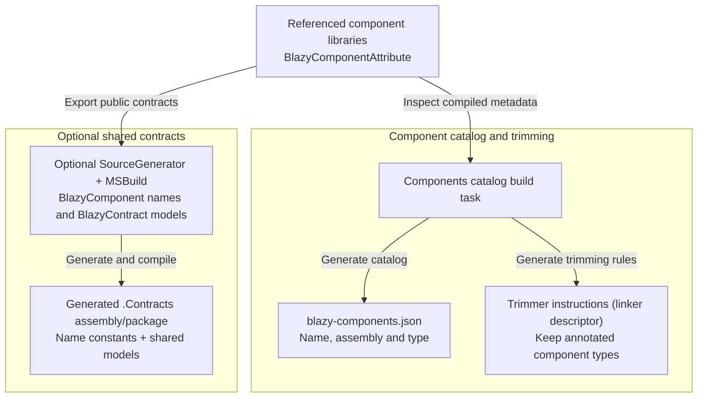
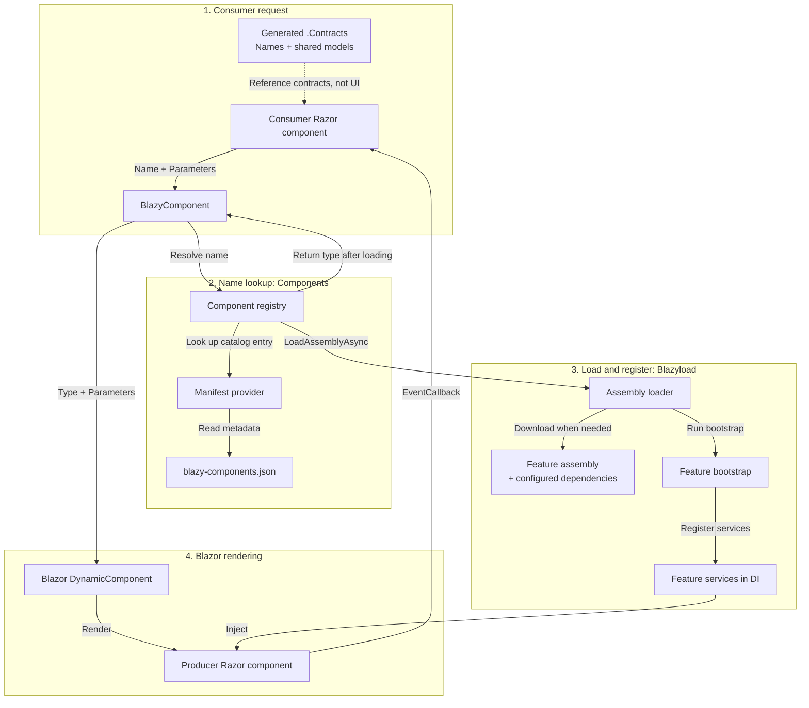

# RonSijm.Blazyload.Components

[Open the demo orchestrator](https://ronsijm.github.io/RonSijm.Blazyload.Components/): [Simple](https://ronsijm.github.io/RonSijm.Blazyload.Components/Simple/), [Extensive](https://ronsijm.github.io/RonSijm.Blazyload.Components/Extensive/) or [Fluxor](https://ronsijm.github.io/RonSijm.Blazyload.Components/Fluxor/). The orchestrator runs the demos inside one Blazor app; switching demos doesn't restart WebAssembly.

**RonSijm.Blazyload.Components is an opinionated plugin framework for Blazor WebAssembly UI**, built on the more general RonSijm.Blazyload assembly loader.

It treats feature libraries as plugins: each can supply UI that another feature displays through an agreed name and parameters, without referencing the UI implementation. For example:

```razor
<BlazyComponent Name="wonderwharf.events" />
```

This is for **Blazor WebAssembly**, where .NET code runs in the browser. It isn't a setup for Blazor components running on a server. The libraries target .NET 8, 9 and 10; the examples use .NET 10.

Start with [Simple](Examples/Simple/README.md) if your use case is "I want this composition, but not an over-complicated setup." It preserves the original Burger/Pizza demo with minimal changes and dependencies, and no source generator. [Extensive](Examples/Extensive/README.md) adds the storefront, generated contracts and fuller explanations.

[Fluxor](Examples/Fluxor/README.md) is an intentionally over-engineered tech demo: lazy UI/state/behavior join an existing store, with state-aware layouts, `[ReduceInto]`, lifecycle/browser effects, public actions and diagnostics. Think of its tiny screen as 10% of a larger application. Components does not depend on Fluxor; the example combines the existing packages in the host.

For your own application, read [Setup](#setup) and [Parameters and callbacks](#parameters-and-callbacks) first. [Generated contracts](#generate-contracts-without-maintaining-another-project) are optional. You don't need to understand the build internals to render a component by name.

## Why?

Bob wants to show upcoming Wonder Wharf events on the restaurant dashboard. But the Bob's Burgers domain shouldn't have a compile-time dependency on Wonder Wharf's UI implementation.

**Without Components:**

```razor
<EventCalendar Title="Upcoming Wonder Wharf events" />
```

Bob's Burgers needs to know the `EventCalendar` type, which means referencing Wonder Wharf's implementation.

**With Components:**

```razor
<BlazyComponent Name="wonderwharf.events" Parameters="@_parameters" />
```

Bob's Burgers knows the component name and its parameters. The host includes Wonder Wharf in the application, and Blazyload downloads its assembly when the component is requested.

The host still references Wonder Wharf. Bob's Burgers doesn't have to.

The extensive example has two domains:

| Project | Components |
|---|---|
| `RonSijm.Demo.BobsBurgers` | `BurgerOfTheDay`, `RestaurantDashboard` |
| `RonSijm.Demo.WonderWharf` | `EventCalendar`, `RideSchedule` |

The dashboard renders its own `<BurgerOfTheDay />` normally and asks for Wonder Wharf's events by name. `EventCalendar` includes its own `<RideSchedule />` normally too. You don't need name-based rendering between components that already belong to the same feature.

## What do host, producer and consumer mean?

These are roles in the application, not extra frameworks you need to install:

| Term | In this example |
|---|---|
| **Host** | The runnable Blazor app. It owns `Program.cs`, application startup and the files published to the website. |
| **Producer** | Wonder Wharf: the library that implements the calendar. |
| **Consumer** | Bob's Burgers: the library that wants to display that calendar. |
| **Contracts** | Shared C# types and names that both features can reference without sharing the UI implementation. |

A feature is a group of related functionality, such as the restaurant or the wharf. Here each feature lives in a **Razor Class Library (RCL)**: a reusable .NET project containing `.razor` components and, optionally, images, JavaScript and CSS.

Building a library produces an **assembly**, usually a DLL containing its compiled C# types. Lazy loading means the browser waits to download that assembly until the feature is requested. It loads the whole assembly, not one `.razor` file at a time. In the .NET 10 examples those assemblies are delivered as `.wasm` files.

There are three separate decisions:

1. **Reference and publish:** the host includes the producer so its code and assets are available on the website.
2. **Download:** lazy-load configuration keeps its implementation assembly out of the normal startup downloads.
3. **Render:** `<BlazyComponent>` asks Blazor to create and display the selected component after loading.

Avoiding a reference from Bob's Burgers doesn't mean avoiding deployment of Wonder Wharf. It means Bob's Burgers can compile without knowing the `EventCalendar` implementation type.

## What does Blazyload do, then?

The two packages handle different parts:

- **RonSijm.Blazyload** loads feature assemblies and their configured dependencies, then runs the feature's service-registration code.
- **RonSijm.Blazyload.Components** adds component names, a generated catalog and the `<BlazyComponent>` wrapper.

You can use Blazyload on its own for lazy-loaded pages or explicit assembly loading. You don't need component attributes or a catalog for that.

That service-registration step is called **bootstrap**. It adds the feature's services to dependency injection (**DI**), the mechanism behind `@inject` and constructor injection. A lazy feature can register its own services when it arrives instead of making the consumer register them at startup.

Components depends on Blazyload. It asks the existing loader to load an assembly, finds the named component type, then renders it through Blazor's `DynamicComponent`. `DynamicComponent` is Blazor's built-in way to render a component when you have a `Type` at runtime rather than a tag such as `<EventCalendar />`.

The optional **RonSijm.Blazyload.Components.SourceGenerator** package creates a separate `.Contracts` assembly containing component-name constants and marked shared models. For a producer configured to create NuGet packages, it also creates a companion contracts package. This happens during the build, not in the browser.

## Why isn't Components part of Blazyload?

I kept them separate because loading a feature and choosing a plugin architecture are different decisions.

**Blazyload is the generic core.** It handles getting an assembly into the running app, loading its configured dependencies and registering its services. It doesn't require you to expose UI through friendly component names, use a component catalog or structure features around shared UI contracts. You can use that loading mechanism for pages, explicit feature loading or your own composition approach.

**Components chooses a particular way to build on that core:**

- Features expose UI through stable component names in a catalog.
- Consumers request those names rather than reference the implementation types.
- Parameters and callbacks cross that boundary through ordinary Blazor properties, supplied in a dictionary.
- Shared model types live in contracts rather than forcing a reference to the producer's UI. Generating those contracts is optional.

Those choices are useful for independently developed features, but they bring conventions and tradeoffs: names must remain stable, the host must publish the right libraries, and parameter errors can appear at runtime rather than during compilation.

Putting that framework into Blazyload would make its component catalog and composition conventions part of the core package even for applications that only need lazy-loaded pages. Keeping it separate lets you use the loading core without adopting this plugin model, or build a different model on top of it.

### When should I use which?

- **Ordinary Blazor components:** use direct tags such as `<EventCalendar />` when referencing the implementation is fine. You get compiler checking of component parameters and don't need this name-based layer.
- **Blazyload alone:** use it when you want lazy-loaded pages or control over loading feature assemblies, without this component-composition framework.
- **Blazyload.Components:** use it when one feature needs to embed another feature's UI without knowing its implementation type, and you're comfortable maintaining the public names and shared parameter contracts.

Here, a **plugin** is a feature library made available by the host and loaded when requested. It runs inside the same Blazor app and service container. This isn't a runtime NuGet installer or a system for unloading plugin assemblies.

It won't suit every application. If a normal project reference already solves your problem, there is no reason to add a plugin framework just to render a component.

## How do the pieces fit together?

The host configures both runtime packages and publishes the producer's assemblies and assets. The **catalog**, also called the **manifest**, is `blazy-components.json`: a generated lookup file mapping each component name to an assembly and a C# type.

The **registry** is the runtime service that looks up those names, requests assembly loading and remembers the resolved types. A **manifest provider** supplies its catalog entries; the default one reads the JSON file. These are implementation details, not services you need to implement for the normal setup.

The build and runtime flows are shown separately. Within each diagram, named regions group related responsibilities.

### Build time: catalog and optional contracts



### Runtime: request, load and render

The catalog and contracts below are the outputs of the build above. Reading them does not run the producer's UI or its build tooling.



Reading the catalog doesn't load the implementations. The registry waits for assembly loading and bootstrap registration before returning the component type. Manual registrations or a custom manifest provider can supply the catalog entries instead.

## Is the attribute just a friendly name?

Mostly, yes. `BlazyComponentAttribute` gives a component a stable logical name and opts it into automatic catalog generation:

```razor
@attribute [BlazyComponent("wonderwharf.events")]
```

The build task records the mapping from `wonderwharf.events` to the producer's assembly and full type name, including its namespace. Bob's Burgers uses the friendly name instead of knowing where `EventCalendar` lives. C# lets you omit the `Attribute` suffix when applying an attribute, so `[BlazyComponent(...)]` is `BlazyComponentAttribute`.

The attribute also helps with **trimming**, the removal of apparently unused code when publishing. Because Components finds the type by name rather than a direct C# reference, the build task tells the trimmer to keep the annotated component. [Services, assets and trimming](#services-assets-and-trimming) explains that part.

It isn't permission to instantiate the component. Normal Blazor rendering doesn't require it:

```razor
<DynamicComponent Type="@typeof(EventCalendar)" />
```

That needs the type to be available and doesn't load its assembly for you.

`<BlazyComponent Name="...">` does need a catalog entry; it doesn't interpret arbitrary names as C# type names. Without the attribute, you can still supply that entry through [manual registration](#what-if-i-dont-want-a-generated-catalog) or a custom manifest provider. The runtime checks that the target is a public component it can instantiate, not that it has this attribute.

## Setup

### 1. Add the package

Run this in each project directory: the WebAssembly host and the feature libraries that declare or render named components.

```powershell
dotnet add package RonSijm.Blazyload.Components
```

The package brings in Blazyload as a dependency. This setup assumes you already have a Blazor WebAssembly app and a producer component library; it doesn't create those projects.

### 2. Give the producer component a name

In the Razor Class Library that owns the component:

```razor
@using Microsoft.AspNetCore.Components
@using RonSijm.Blazyload.Components
@attribute [BlazyComponent("wonderwharf.events")]

<h2>@Title</h2>

@code {
    [Parameter]
    public string Title { get; set; } = "Wonder Wharf events";
}
```

The attribute also works on a C# component or Razor code-behind.

- Names are case-sensitive.
- Each name must be unique in the host's catalog.
- Keep names stable; changing one breaks consumers that use it.
- The component must be public and instantiable: not an abstract class or a generic type whose type arguments are still unspecified.

The logical name doesn't have to match the class name or namespace. You can move the implementation without changing every consumer.

### 3. Configure the host

Add this to the host's `Program.cs`, using its existing `WebAssemblyHostBuilder`, before `builder.Build()`:

```csharp
using RonSijm.Blazyload;
using RonSijm.Blazyload.Components;

builder.UseBlazyload();
builder.Services.AddBlazyloadComponents();
```

Add a project reference or NuGet reference to the producer **in the host**, so Blazor can publish its assembly and static assets. Add the following to the host's `.csproj` to defer the implementation assembly's startup download:

```xml
<ItemGroup>
  <BlazorWebAssemblyLazyLoad Include="RonSijm.Demo.WonderWharf.wasm" />
</ItemGroup>
```

This is the assembly filename used by the .NET 10 example, not the component's friendly name. Mark implementation-only dependencies as lazy too if they should wait until the feature is used.

Keep shared parameter contracts available when their consumer loads. For example, Bob's Burgers needs the `EventCalendarModel` type to construct the value it passes, even before the calendar UI appears. In a host that uses that model at startup, its contracts assembly must be available at startup too.

The package generates `blazy-components.json` by inspecting type and attribute information in the host's compiled library references. It also reads components from referenced packages, so this doesn't require access to the producer's source code or a handwritten manifest.

### 4. Render it from the consumer

Add `@using RonSijm.Blazyload.Components` to `_Imports.razor`, or put it in the component itself:

```razor
@using RonSijm.Blazyload.Components

<BlazyComponent Name="wonderwharf.events" Parameters="@_parameters" />

@code {
    private readonly Dictionary<string, object?> _parameters = new()
    {
        ["Title"] = "Upcoming Wonder Wharf events"
    };
}
```

The consumer references Components, but not Wonder Wharf's implementation.

## Parameters and callbacks

A Blazor parameter is a property marked `[Parameter]` on the target component. Normally you set it through markup such as `<EventCalendar Title="Team outing" />`. Here the dictionary key `"Title"` selects that same property, and its value supplies the data.

`Parameters` accepts an `IReadOnlyDictionary<string, object?>` because different properties can have different value types:

- Strings, numbers, complex objects and nulls are forwarded unchanged.
- `EventCallback<T>` works without a separate event API.
- Updating `Parameters` updates the rendered component without another assembly load.
- Changing `Name` selects a different component.

`EventCallback<T>` is Blazor's typed callback: the producer invokes it with a value, and the consumer's handler receives that value. It doesn't require an HTTP endpoint or a separate event bus. The [Simple example](Examples/Simple/README.md#parameters-and-callbacks) shows both the dictionary and the callback handler.

Blazor checks parameter names and types at runtime. For example, `"Titel"` instead of `"Title"` or the wrong model type can compile in the consumer but fail when the calendar renders. The consumer's Razor compiler cannot check a component type it doesn't reference.

If both features use a model, they must reference the **same compiled model type**, not two separate records that happen to have matching properties. Values are passed directly as .NET objects; Components doesn't serialize or convert them. A contracts library holds that shared type without including the UI.

You can maintain a small contracts project yourself, as Simple does. The source-generator package can create it for you instead. Extensive generates `RonSijm.Demo.WonderWharf.Contracts`; Bob's Burgers needs `EventCalendarModel`, not the code that draws the calendar.

See [Simple's parameter and callback example](Examples/Simple/README.md#parameters-and-callbacks) for the smaller setup, or [Extensive](Examples/Extensive/README.md#parameters-and-callbacks) for generated model contracts.

## Generate contracts without maintaining another project

This is optional. Use it when you want to keep the shared model source in the producer and stop maintaining a separate contracts project.

A **source generator** is code that runs as part of the C# compiler and adds generated C# source. This package also includes an **MSBuild task**: a build step run by `dotnet build` that prepares and compiles the separate contracts project. The generator supplies names; the build task handles moving the marked models' compiled definitions. Neither tool runs in the browser.

Add this package reference inside an `<ItemGroup>` in the producer's `.csproj`:

```xml
<PackageReference Include="RonSijm.Blazyload.Components.SourceGenerator"
                  Version="1.0.0"
                  PrivateAssets="all" />
```

`PrivateAssets="all"` keeps the tooling package from becoming a dependency of packages that consume your library. It doesn't remove the generated contracts DLL, which both features need at runtime.

Keep models in the producer's source, wherever they belong. Mark the ones consumers need:

```csharp
using RonSijm.Blazyload.Components;

namespace RonSijm.Demo.WonderWharf.Contracts;

[BlazyContract]
public sealed record EventCalendarModel(string RestaurantName);
```

The tooling supplies `[BlazyContract]`; you don't need to declare the attribute yourself. The existing component attribute supplies the name:

```razor
@attribute [BlazyComponent("wonderwharf.events")]
```

Building `RonSijm.Demo.WonderWharf` automatically builds `RonSijm.Demo.WonderWharf.Contracts.dll`. It contains the marked model and:

```csharp
namespace RonSijm.Demo.WonderWharf.Contracts;

public static class WonderWharfComponents
{
    public const string Events = "wonderwharf.events";
}
```

The class defaults to the last segment of the producer's assembly name plus `Components`. Each member comes from the logical name's last segment: `events` becomes `Events`, and `burger-of-the-day` becomes `BurgerOfTheDay`.

The consumer can then write:

```razor
@using RonSijm.Demo.WonderWharf.Contracts

<BlazyComponent Name="@WonderWharfComponents.Events" Parameters="@_parameters" />
```

`Name` is still the rendering API. The generated member is a string constant, not a new `Component` parameter. Typing `WonderWharfComponents.Eventz` is now a compiler error because that member doesn't exist; typing an incorrect string literal would not be. The parameter dictionary is still checked by Blazor at runtime.

### Who owns the model?

The generated contracts assembly owns the **only compiled definition**. Your source file stays in the producer, unchanged.

This matters because .NET identifies a type using its assembly as well as its namespace and name. Compiling `EventCalendarModel` separately into two assemblies creates two different types, even if their source is identical. A calendar expecting one couldn't accept an instance of the other.

The MSBuild task builds a contracts-only version of marked source declarations under `obj`, the usual folder for generated build files. It excludes those declarations from the producer's compilation and adds:

```csharp
[assembly: System.Runtime.CompilerServices.TypeForwardedTo(
    typeof(RonSijm.Demo.WonderWharf.Contracts.EventCalendarModel))]
```

`TypeForwardedTo` tells .NET where to find the model when code looks for it through the producer: in the contracts assembly. It is generated build output; you don't write it yourself. The producer forwards to contracts, not the other way around.

Both features therefore use the same .NET type. Referencing contracts alone doesn't reference or download Wonder Wharf's UI implementation.

A source generator alone cannot remove an existing declaration from a compilation. That is why the package includes an MSBuild task as well as the generator. It doesn't edit your source files or require a contracts folder/project.

### Reference and publish the contracts

For a producer configured to create a NuGet package, run:

```powershell
dotnet pack .\RonSijm.Demo.WonderWharf.csproj -c Release
```

This writes both the producer package and its companion `.Contracts` package to `PackageOutputPath`, the NuGet output-directory setting. A producer targeting several .NET versions gets one contracts package with a matching assembly for each target.

The demo projects set `IsPackable=false`, so they don't create these packages. This command describes packaging your own producer.

Publish both packages to your feed. The feature that embeds the component installs **only** the contracts package (alongside Components):

```powershell
dotnet add package RonSijm.Demo.WonderWharf.Contracts
```

The host still references the producer for deployment. The producer package includes the same contracts DLL next to its implementation DLL, so the host has the forwarded types available too. This is the same assembly identity, not a second model definition. Keep producer and contracts package versions aligned.

For projects in the same source tree, you don't need to publish a package for every local edit. Add the same tooling package to the consumer with `PrivateAssets="all"`, then add the following to its `.csproj`. Disabling its own export stops it generating an unnecessary contracts assembly for itself:

```xml
<PropertyGroup>
  <BlazyComponentsExportContracts>false</BlazyComponentsExportContracts>
</PropertyGroup>
<ItemGroup>
  <BlazyComponentContractReference Include="..\RonSijm.Demo.WonderWharf\RonSijm.Demo.WonderWharf.csproj" />
</ItemGroup>
```

`BlazyComponentContractReference` is an item understood by this package's build tooling, not a built-in .NET project reference. It builds the producer's contracts, then gives the consumer a reference to that DLL and any explicitly shared dependencies. It doesn't give the consumer a reference to the producer's UI or services.

For a WebAssembly host referencing the producer's source project, install the same tooling package in the host too and set `BlazyComponentsExportContracts=false`. Keep its normal producer reference for deployment, and add the contracts-only item as well so the generated contracts DLL is published. It downloads at startup unless you explicitly mark it lazy and the host doesn't need its types yet.

A host using the producer's NuGet package gets the contracts DLL from that package instead.

### Export rules

These constraints matter when choosing which types to mark, or when an export fails:

- Component names must be nonempty string literals.
- Logical-name suffixes must produce distinct C# members.
- Mark public, top-level C# types; their namespaces stay unchanged.
- Partial declarations, generic models and nested types inside a marked model move together.
- Models must compile without the producer's implementation.

Only `[BlazyContract]` models are exported. The tool doesn't follow every component parameter and automatically export all types it refers to. If a marked model contains another shared model or enum, mark that type too unless it already comes from a shared dependency.

Use the attributes directly or through an alias declared with `using Name = ...;` in the same file. Global attribute aliases aren't resolved by this source scan. Mark models in `.cs` files, not inside Razor `@code` blocks. Put unrelated implementation-only `using` directives in a separate source file if they prevent the model from compiling on its own.

For an external dependency used by a model, mark its normal producer reference for contracts export:

```xml
<ItemGroup>
  <PackageReference Include="ExampleCorp.Shared.Models" Version="1.2.3" BlazyContract="true" />
  <ProjectReference Include="..\Shared.Models\Shared.Models.csproj" BlazyContract="true" />
</ItemGroup>
```

Those dependencies belong in the contracts assembly/package too. Unmarked implementation dependencies aren't copied. Don't point contract dependencies back at the UI implementation.

For custom naming, set `BlazyComponentsContractsNamespace`, `BlazyComponentsContractsClassName` or `BlazyComponentsContractsPackageId` inside a `<PropertyGroup>` in the producer's `.csproj`. Defaults are `$(RootNamespace).Contracts`, the assembly-name suffix plus `Components`, and `$(PackageId).Contracts`. The `$(...)` notation means "use the value of this MSBuild project property."

## What gets loaded?

For a component that hasn't been resolved yet:

1. Components looks up its name in the catalog.
2. Blazyload loads the assembly and its configured dependencies.
3. Blazyload runs bootstrap/service registration and finalizes loading.
4. Components checks the target type and lets Blazor render it.

The catalog contains names and type information, not implementation code. Reading it doesn't load or execute all the component implementations.

**Resolution** means turning a friendly name into a loaded component `Type`. The registry remembers that result, so repeated or simultaneous requests for the same name reuse the same work. Different names from the same producer assembly also share one loader task in that registry, preventing overlapping requests from bootstrapping the producer twice. It caches the lookup and load operation, not the rendered component instance or its UI state.

This sharing applies to requests through the same registry. Separate registries and direct calls to core's loading/navigation API are outside it.

When an assembly is already loaded, Components searches the loader's results, its `AdditionalAssemblies` list and the assemblies available to .NET. It doesn't assume a download must happen for every render.

You can also load a feature directly through Blazyload:

```csharp
await assemblyLoader.LoadAssemblyAsync("RonSijm.Demo.WonderWharf.wasm");
```

The loader returns newly loaded assemblies. An already loaded or preloaded request can return an empty list; that doesn't mean the assembly is missing.

## Services, assets and trimming

Use Blazyload's `IBootstrapper` for services owned by a lazy-loaded feature. The [Wonder Wharf example](Examples/Extensive/README.md#what-about-services) registers `WharfEventService` there, rather than making Bob's Burgers register Wonder Wharf's internals.

Without service registration, Blazor can't satisfy an injection such as `@inject WharfEventService Events`, even if the component's code has downloaded successfully. Bootstrap runs before Components returns the type for rendering.

For Razor Class Library assets:

- Reference the producer from the host.
- Use the normal `_content/{PackageId}/...` paths for images and JavaScript.
- Include the host's generated stylesheet for scoped CSS.

`_content/{PackageId}/...` is Blazor's URL convention for files supplied by a Razor Class Library. `PackageId` defaults to the assembly name unless the library overrides it, which is why the demo uses `_content/RonSijm.Demo.WonderWharf/...`.

**Scoped CSS** is a stylesheet such as `EventCalendar.razor.css`. Blazor rewrites its selectors so they apply to that component and makes the library's bundled styles available through the host's `{HostAssemblyName}.styles.css`. Keep the host's link to that stylesheet; you don't link individual `.razor.css` files. See [Blazor's RCL documentation](https://learn.microsoft.com/en-us/aspnet/core/blazor/components/class-libraries?view=aspnetcore-10.0) for the standard asset and CSS setup.

Loading a DLL doesn't deploy its images or scripts. Those files still need to be in the published application. A stylesheet request at startup also doesn't prove the feature's implementation assembly has loaded.

**Reflection** means finding a type or its members at runtime. A trimmer may not see a string-based lookup such as `"EventCalendar"` as a use of that type. The generated **linker descriptor** is an XML set of instructions telling the trimmer to keep the annotated components; it isn't another runtime library.

Bootstrap and DI code still follow Blazyload's trimming requirements. The browser example covers a normal trimmed Release publication; server rendering and ahead-of-time (**AOT**) compilation aren't covered. AOT is a separate build mode that compiles .NET code ahead of execution.

## What if I don't want a generated catalog?

Register the entries yourself:

```csharp
builder.Services.AddBlazyloadComponents(options =>
{
    options.ManifestPath = null;
    options.Register("wonderwharf.events", "RonSijm.Demo.WonderWharf", "RonSijm.Demo.WonderWharf.Components.EventCalendar");
});
```

The three arguments are the friendly name, the assembly name without a filename extension, and the component's namespace plus class name. Use the assembly's name, not its file path or NuGet package ID.

This works even if `EventCalendar` has no `BlazyComponentAttribute`. The registration supplies the name-to-type mapping that the attribute would otherwise generate. If an attribute is present, its name must match the registration; otherwise the saved mapping no longer describes the actual component and is rejected.

For an unattributed component registered only by strings, preserve the type and the members you need when publishing with trimming. The generated linker descriptor covers the attributed components discovered by the build task, not arbitrary manual registrations.

To stop generating the manifest:

```xml
<PropertyGroup>
  <BlazyComponentsGenerateManifest>false</BlazyComponentsGenerateManifest>
</PropertyGroup>
```

Other catalog options:

- Set `ManifestPath` to use a different file.
- Register an `IBlazyComponentManifestProvider` before `AddBlazyloadComponents` to supply your own source.
- Add `BlazyComponentsAssembly` MSBuild items to inspect assembly files outside the host's normal references.

`ManifestPath` defaults to `blazy-components.json`, resolved against `NavigationManager.BaseUri`, the application's base URL. If the app is hosted at `/RonSijm.Blazyload.Components/`, the default catalog URL is `/RonSijm.Blazyload.Components/blazy-components.json`.

The default provider combines configured entries with the manifest. Duplicate names are rejected, not overwritten. Extra MSBuild assembly items contribute metadata only; they don't deploy those assemblies or their assets.

If you're building your own rendering code, `IBlazyComponentRegistry.ResolveAsync` returns a descriptor with its resolved `ComponentType`.

## What happens when something fails?

`BlazyComponent` renders nothing while looking up and loading the component; it doesn't include a loading indicator. Errors reach Blazor instead of becoming an empty "successful" result.

An `ErrorBoundary` is Blazor's component for catching errors from its child components and showing fallback UI. For example:

```razor
@using Microsoft.AspNetCore.Components.Web
@using RonSijm.Blazyload.Components

<ErrorBoundary>
    <ChildContent>
        <BlazyComponent Name="wonderwharf.events" />
    </ChildContent>
    <ErrorContent>
        <p role="alert">The calendar could not be loaded.</p>
    </ErrorContent>
</ErrorBoundary>
```

This controls the error display, not loading retries.

| Exception | What to check |
|---|---|
| `BlazyComponentNotFoundException` | Component name, case and catalog entry |
| `BlazyComponentRegistrationException` | Manifest, manual registrations or duplicate names |
| `BlazyComponentLoadException` | Assembly files, lazy-load configuration or feature initialization |
| `BlazyComponentTypeException` | Missing type, a catalog that doesn't match the deployed code, or a component Blazor can't instantiate |

A load error keeps the useful chain:

```text
BlazyComponentLoadException: component 'wonderwharf.events'
    -> BlazyAssemblyLoadException: assembly 'RonSijm.Demo.WonderWharf.wasm'
        -> original download, bootstrap or registration error
```

The core exception names the requested assembly in its message and keeps the original error in `InnerException`. That nested exception is where you can distinguish, for example, a failed download from a failure in service registration.

Failed resolutions are remembered too. In the normal WebAssembly host, navigating away and back or rendering another `<BlazyComponent>` doesn't create a fresh registry or retry the failed name. A full page reload starts a new application and allows a new attempt; it doesn't fix a missing file or broken bootstrap.

Errors are logged through Blazyload's `IBlazyLogger`. Set `EnableLogging = true` in component options if you also want resolution messages.

## Try a demo

From the repository root, with a .NET 10 SDK:

```powershell
dotnet run --project .\Examples\Orchestrator
```

The orchestrator is a small host app that chooses which demo to display. It requests `burger.editor`, `bobsburgers.dashboard` or `fluxor.bobsburgers.dashboard` through `<BlazyComponent>` to load each demo's first component. All twelve feature assemblies, including shared models and the optional Fluxor tracking module, wait until needed.

Blazor routing changes the displayed component without loading another HTML document or restarting .NET in the browser. Loaded assemblies and registered services remain available. Component-local fields reset with new instances; the Fluxor demo's store state remains until the browser is refreshed.

**Simple** keeps the original Burger editor. Click **Show pizza calendar**, select a date and change its title. Visible code blocks explain consumer composition, parameters/callbacks, startup, publication and the producer's service bootstrap. It uses string component names and a tiny handwritten model contract; it doesn't need generated identifiers or a contracts-export pipeline.

**Extensive** uses a sales-site layout to explain component composition. The consumer's Razor request, loading steps and project-reference boundary are visible rather than hidden behind restaurant copy. Click **Load Wonder Wharf component** to load the calendar and its event-service dependency. Use **Send DateSelected callback** and **Update Title parameter** to see ordinary Blazor interaction across the domain boundary.

The loaded calendar shows its producer code, generated model contract and asset results. **Extra tooling** compares the generated contracts with Simple's handwritten version. `BurgerOfTheDay` and `RideSchedule` explain direct rendering within an already-loaded feature. No expandable sections are needed to see what happens.

**Fluxor** keeps that contracts boundary while loading Wonder Wharf's state and behavior with its UI. Two named components share producer state; Bob's layout composes its own restaurant/preferences features. Compare name-based mounting with native assembly/path preloading, callback selection with public application actions, and lifecycle-driven JS with navigation effects. The [setup README](Examples/Fluxor/README.md#benefit-to-working-example) maps each integration benefit to working controls and source files, including lifetime and integration boundaries.

Its optional publication-tracking module demonstrates late reducers and instance/static method effects, an explicit preparation failure, corrected registration retry and repeat registration without duplicate handlers. The ordinary feature and extension retain assembly scanning; this is not a failed-assembly retry.

Open the browser's developer tools (**F12**), select **Network**, enable **Disable cache** and reload before filtering for `WonderWharf`. You can watch the feature assemblies download on demand. In this .NET 10 example the DLLs are delivered as `.wasm` files; a content-based **fingerprint** in the filename lets browsers cache the correct version. The small `WonderWharf.Contracts` assembly loads when you choose Extensive; the implementation and services wait for the storefront's button.

The [orchestrator guide](Examples/Orchestrator/README.md) includes the demo-project diagram and explains the shared host, lazy loading and state lifetimes. The [example overview](Examples/README.md) compares the demos and includes commands for their standalone hosts. Each demo has its own setup, project-reference explanation and DevTools walkthrough.

## Build, test and package

Run from the repository root:

```powershell
dotnet build .\RonSijm.Blazyload.Components.sln -nr:false
dotnet test .\Tests\RonSijm.Blazyload.Components.Tests\RonSijm.Blazyload.Components.Tests.csproj -nr:false
dotnet pack .\src\RonSijm.Blazyload.Components\RonSijm.Blazyload.Components.csproj -c Release -nr:false
dotnet pack .\src\RonSijm.Blazyload.Components.SourceGenerator\RonSijm.Blazyload.Components.SourceGenerator.csproj -c Release -nr:false
```

Packages are written to `packages`. The runtime package includes its MSBuild integration, catalog-generation task and this README. The source-generator package includes the compiler plugin, contracts-export tasks and build integration; the NuGet workflow publishes both packages.

`-nr:false` disables MSBuild worker-process reuse after the command finishes. It isn't a Blazyload setting.

The source uses the Blazyload 2.0.2 NuGet package rather than a sibling checkout. When preparing these releases, publish Blazyload first; see the [release order](#github-deployment). `global.json` selects a stable .NET 10 SDK.

Publishing a single example project from a fresh checkout also restores and builds the source-generator tooling it invokes. A prior solution build isn't required.

### Visual Studio

Use **Visual Studio 2026** for the .NET 10 examples and tests. Visual Studio's main MSBuild process runs on .NET Framework; these tasks need modern .NET, so the build runs them in a separate compatible process. You don't need to configure that process yourself.

If the test compiler can't find `Xunit`, `Bunit` or `NSubstitute`, restore the solution's NuGet packages:

```powershell
dotnet restore .\RonSijm.Blazyload.Components.sln
```

Repository builds load temporary copies of the tooling DLLs so Visual Studio doesn't lock the original files that the next build needs to replace. These loaded copies are build-tool caches, not application outputs.

For the published-browser check:

```powershell
.\Verify-Publish.ps1
.\Verify-Publish.ps1 -GitHubPages
.\Verify-Publish.ps1 -Demo Simple
.\Verify-Publish.ps1 -Demo Extensive
.\Verify-Publish.ps1 -Demo Fluxor
.\Verify-Publish.ps1 -Demo All
```

The script publishes in Release and checks lazy assembly requests, DI, callbacks, CSS, images and JavaScript in a browser, plus dynamic Fluxor registration, handled service errors and state lifetime. By default it checks all three demos inside the orchestrator, including switching without another document or runtime download. `-Demo Simple`, `Extensive` or `Fluxor` selects a standalone host; `All` checks all four hosts. Microsoft Edge is the default; use `-BrowserChannel chrome` for installed Chrome, or install Playwright Chromium and use `-BrowserChannel chromium`.

Run this separately from the unit/rendering tests; it needs the published files.

## GitHub deployment

| Workflow | On `main` | On a pull request |
|---|---|---|
| `build_main.yml` | Build, test, pack and publish to NuGet | Build, test and pack |
| `deploy_demo1.yml` | Publish, browser-check and deploy the orchestrator to `gh-pages` | Publish and browser-check the orchestrator and all three demos |

Add `NUGET_API_KEY` to the repository secrets. For a new package release, update `VersionPrefix` in `BuildSettings\NuGetVersioning.props`; duplicate versions are skipped.

**Release order for Components 1.1.1:** publish the four Syringe 1.1.0 packages first, then Blazyload, Blazyload.Fluxor and Blazyload.Hosting 2.0.2, and finally Components and its SourceGenerator 1.1.1. Components now requires Blazyload 2.0.2, whose dependency minimum brings in Syringe 1.1.0. The Fluxor demo also references Syringe.Fluxor 1.1.0 directly. Publish the Blazyload packages before running this repository's normal restore or CI build; an older published package cannot acquire these new dependency minimums without a new version.

Set **Settings > Pages** to the **gh-pages** branch, root folder. The orchestrator is at <https://ronsijm.github.io/RonSijm.Blazyload.Components/>. `Simple/`, `Extensive/` and `Fluxor/` are routes in that app, with copies of the same host shell for direct links and refreshes.

Deployments replace `gh-pages` with a single-commit snapshot of the current website instead of keeping deployment history. This discards the old history on `gh-pages`, not the source history on `main`.

The Pages publication adjusts `<base href>` in `index.html`. That setting tells Blazor where the application starts, so relative requests find the assemblies and catalog under the repository subdirectory rather than the website root.

It also creates `.nojekyll` to disable GitHub Pages' Jekyll processing, which otherwise ignores underscore-prefixed directories such as Blazor's `_framework` and `_content`.

## Related Projects

Components is an optional, more opinionated layer on top of Blazyload, not a replacement for it. Use Blazyload directly if you only need assembly loading or prefer a different way of integrating your components.

- **[RonSijm.Blazyload](https://github.com/RonSijm/RonSijm.Blazyload)** - The generic lazy-loading core that loads assemblies and their dependencies and runs their service-registration bootstrap.
